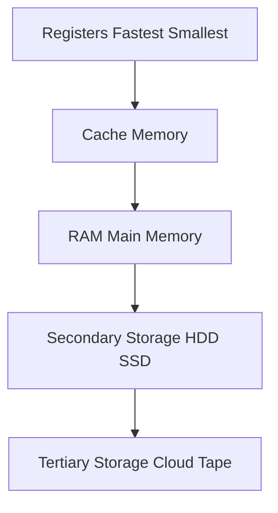
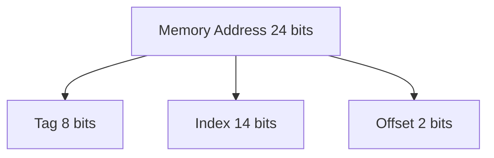
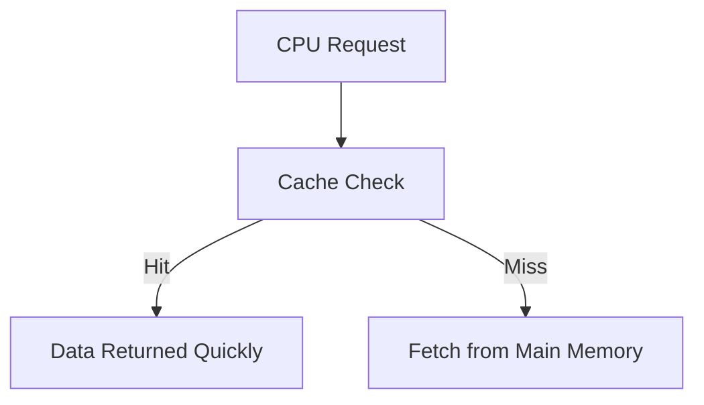
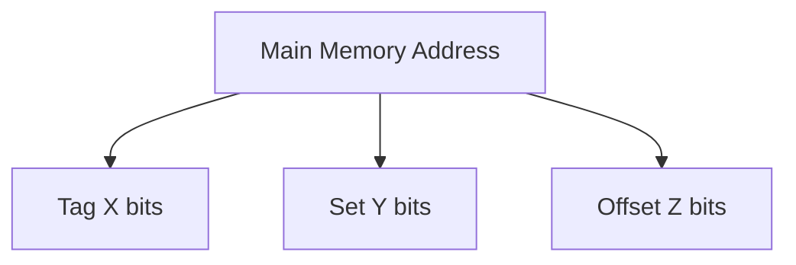
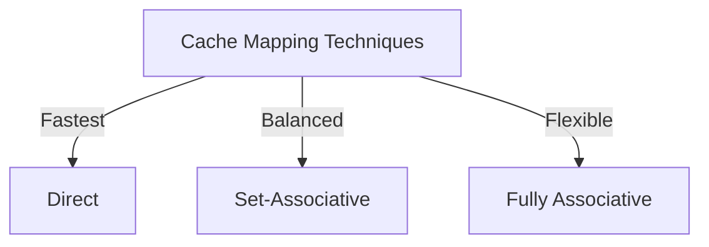
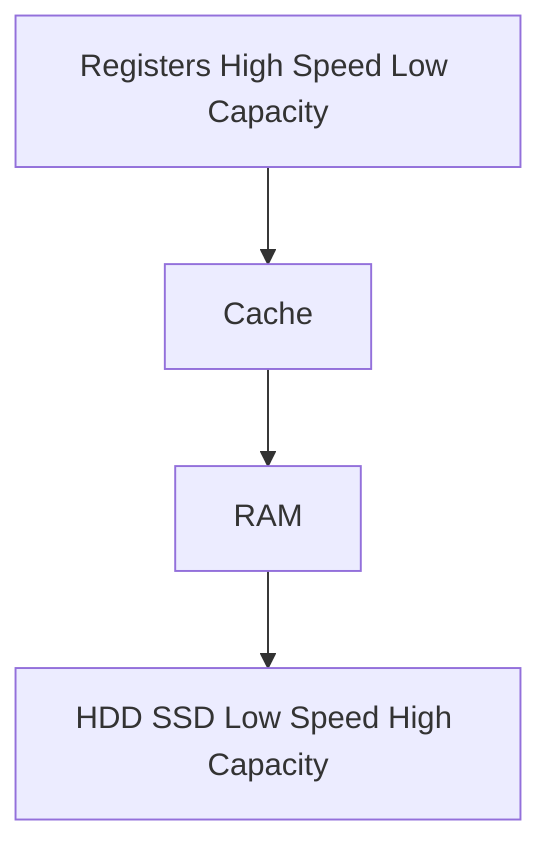
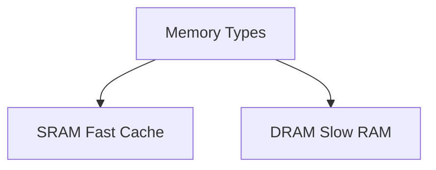

# Unit-3 Question Bank Answers

## 1. Memory Hierarchy

![[Computer Organization and Architecture Lecture 12#**The Memory Pyramid**]]

## 2. Direct Mapped Cache Calculations
- **a. Number of Bits in Tag**:
  - Calculation and explanation.
- **b. Tag Directory Size**:
  - Calculation and explanation.

## 3. Associative Memory
- **Functioning**: Describe how associative memory works and its associated registers.

## 4. Elements of Cache Design
- **Definition**: List and explain five key elements of cache design.

## 5. Types of Memories in Computer Architecture
- **Classification**: Classify different types of memories and explain one in detail.

## 6. Computer Memory Hierarchy
- **Sketch and Explanation**: Provide a sketch and explain the structure of computer memory hierarchy.

## 7. Direct Mapping Technique
- **Details**: Discuss the direct mapping technique in detail.

## 8. Random Access Memory (RAM)
- **Definition and Types**: Explain what RAM is and discuss its types in detail.

## 9. Set Associative Mapping Technique
- **Details**: Discuss the set associative mapping technique in detail.

## 10. Set Associative Mapping Calculations
- **Explanation**: Explain set associative mapping and perform the required calculations.

## 11. Cache Memory and Associative Mapping
- **Definition and Comparison**: Define cache memory and explain how associative mapping overcomes direct mapping.

## 12. Cache Hit and Miss
- **Explanation**: Define cache hit and miss, and explain hit latency and miss latency.

## 13. Characteristics of Memory System
- **Short Note**: Write a short note on the characteristics of the memory system.

## 14. Set-Associative Cache Design
- **Design and Address Interpretation**: Design the cache structure and show how processor addresses are interpreted.

## 15. Cache Mapping Techniques
- **Need and Differences**: Explain the need for cache mapping and differentiate between direct, associative, and set associative mapping techniques.

## 16. Memory Hierarchy: Access Time, Cost, and Capacity
- **Explanation**: Discuss memory hierarchy with respect to access time, cost, and capacity.

## 17. SRAM vs DRAM
- **Comparison**: Compare SRAM and DRAM.

## 18. Direct Mapping Calculations
- **Explanation**: Perform the required calculations using the direct mapping technique.

## 19. SRAM vs DRAM: Structure
- **Difference and Structure**: Demonstrate the difference between SRAM and DRAM, and draw the DRAM structure.

## 20. Elements of Cache Design
- **List and Explanation**: List and explain the elements of cache design.

## 21. Performance Characteristics of Two-Level Memory
- **List and Explanation**: List and explain the performance characteristics of two-level memory.

## 22. Memory Characteristics
- **List and Explanation**: List and explain different memory characteristics.

## 23. Associative Mapping and Address Translation
- **Explanation**: Explain associative mapping and its address translation.

## 24. Set-Associative Mapping and Address Translation
- **Explanation**: Explain set-associative mapping and its address translation.

## 25. High-Speed Memory
- **a. Associative Memory**: Write a short note on high-speed associative memory.
- **b. Interleaved Memory**: Write a short note on high-speed interleaved memory.

### **Formulas for Tag Size, Index Size, and Offset in Direct Mapped Cache**

To determine the number of bits required for **Tag**, **Index**, and **Offset** fields in a memory address for **direct-mapped cache**, use the following formulas.

---

## **1) Offset Size (Block Offset)**
The **Offset** determines the specific byte/word inside a block.

$$
\text{Offset Size} = \log_2 (\text{Block Size})
$$

- **Block Size** = Number of bytes in a block.
- **Offset Bits** = Number of bits required to address a specific byte within a block.

**Example:**
- If **Block Size = 16 bytes**, then
  $$
  \log_2 (16) = 4 \text{ bits (Offset)}
  $$

---

## **2) Index Size**
The **Index** determines which **cache line** a block maps to.

$$
\text{Index Size} = \log_2 (\text{Number of Cache Lines})
$$

- **Number of Cache Lines** = **(Cache Size) / (Block Size)**
- **Index Bits** = Number of bits required to select a cache line.

**Example:**
- If **Cache Size = 512 bytes** and **Block Size = 16 bytes**:
  $$
  \text{Number of Cache Lines} = 512 / 16 = 32
  $$
  $$
  \log_2 (32) = 5 \text{ bits (Index)}
  $$

---

## **3) Tag Size**
The **Tag** uniquely identifies a block in memory.

$$
\text{Tag Size} = \text{Total Address Bits} - (\text{Index Bits} + \text{Offset Bits})
$$

- **Total Address Bits** = \(\log_2(\text{Total Memory Size})\)
- **Index Bits** = \(\log_2(\text{Number of Cache Lines})\)
- **Offset Bits** = \(\log_2(\text{Block Size})\)

**Example:**
- If **Total Memory Size = 16 KB** = \(2^{14}\) addresses
- **Index Bits = 5**, **Offset Bits = 4**
  $$
  \text{Tag Size} = 14 - (5 + 4) = 5 \text{ bits (Tag)}
  $$

---

## **Final Formula Summary**
| Field   | Formula |
|---------|---------|
| **Offset Size** | \( \log_2 (\text{Block Size}) \) |
| **Index Size** | \( \log_2 (\text{Cache Lines}) \) |
| **Tag Size** | \( \text{Total Address Bits} - (\text{Index Bits} + \text{Offset Bits}) \) |

This helps efficiently divide the memory address in **Direct Mapping** and optimize cache lookups.
# **COA Unit-3 Question Bank Solutions**

## **1. Memory Hierarchy Brief**

- Registers -> Cache -> Main Memory RAM -> Secondary Storage -> Tertiary Storage
- Speed: Registers Fastest -> Tertiary Slowest
- Cost: Registers Expensive -> Tertiary Cheapest
- Capacity: Registers Least -> Tertiary Most

---

## **2. Direct Mapped Cache Calculation**

### **Given:**

- Cache Size = 16KB = $2^{14}$ Bytes
- Block Size = 256 Bytes = $2^8$
- Main Memory = 128KB = $2^{17}$

### **Find:**

1. **Tag Bits:**
    
    - Offset = $log_2 256 = 8$ bits
    - Index = $log_2 16K/256 = 6$ bits
    - Tag = $17 - 6+8 = 3$ bits
2. **Tag Directory Size:**
    
    NumberofLines=16K/256=64Number of Lines = 16K/256 = 64 TagDirectorySize=64∗3=192bitsTag Directory Size = 64 * 3 = 192 bits

---

## **3. Associative Memory and Registers**

- **Fully Associative**: Any block can go into any cache line
- **Registers:**
    - **Key Register**: Stores tag to compare with memory block
    - **Mask Register**: Defines which parts of the key are compared
    - **Match Register**: Indicates successful match

---

## **4. Five Elements of Cache Design**

- **Block Size**: Size of memory block fetched
- **Cache Size**: Total cache storage capacity
- **Associativity**: Mapping strategy Direct, Set, Fully Associative
- **Replacement Policy**: LRU, FIFO, Random
- **Write Policy**: Write-back vs Write-through

---

## **5. Memory Types**

- **Primary Memory** RAM, ROM
- **Secondary Storage** HDD, SSD
- **Cache Memory**
- **Virtual Memory**
- **Registers**

### **Example: RAM Primary Memory**

- Volatile
- Fast access
- Stores active programs and data

---

## **6. Computer Memory Hierarchy Diagram**

---

## **7. Direct Mapping Technique Detailed**

- **Each memory block maps to exactly one cache line**
- **Steps:**
    - Extract index from address
    - Check tag match
    - If match -> Hit, else -> Miss replace block

---

## **8. Random Access Memory RAM and Types**

- **RAM**: Volatile memory, stores active data
- **Types:**
    - **SRAM Static RAM**: Faster, expensive, used in cache
    - **DRAM Dynamic RAM**: Slower, cheaper, used in main memory

---

## **9. Set Associative Mapping Detailed**

- **Blocks are divided into sets, each set maps to multiple lines**
- **Advantages:**
    - Reduces conflict misses
    - Balance between direct and fully associative mapping

---

## **10. Set Associative Mapping Calculation**

### **Given:**

- Main Memory = 16MB = $2^{24}$ Bytes
- Cache Size = 64KB = $2^{16}$ Bytes
- Block Size = 4B = $2^2$

### **Find:**

- **Tag Bits**:
    
    - Offset = 2 bits
    - Index = $log_2 64K/4 = 14$ bits
    - Tag = $24 - 14+2 = 8$ bits
- **Tag Directory Size:**
    
    TagDirectorySize=214∗8=128Kbits Tag Directory Size = 2^{14} * 8 = 128K bits

---

## **11. Associative Mapping vs Direct Mapping**

- **Direct Mapping**: One-to-one block mapping Fast, simple, but more conflicts
- **Associative Mapping**: Any block to any cache line Reduces conflicts but requires extra hardware

---

## **12. Cache Hit, Miss, Latency**

- **Cache Hit**: Data found in cache
- **Cache Miss**: Data not found, needs fetching
- **Hit Latency**: Time to access cache
- **Miss Latency**: Time to fetch from memory

---

## **13. Memory System Characteristics**

- **Volatility**: RAM volatile, ROM non-volatile
- **Access Time**: SRAM < DRAM < HDD
- **Cost**: Registers High -> HDD Low

---

## **14. Set-Associative Cache Design**

---

## **15. Need for Cache Mapping and Comparisons**

- **Why** Faster data access, reduced memory latency
- **Comparisons:**
    - **Direct**: Fast, simple, but high conflicts
    - **Set-Associative**: Balanced
    - **Fully Associative**: Least conflicts, high cost

---

## **16. Memory Hierarchy Access Time, Cost, Capacity**

|Memory|Access Time|Cost|Capacity|
|---|---|---|---|
|Registers|Fastest|High|Low|
|Cache|Very Fast|Medium|Low|
|RAM|Fast|Lower|Medium|
|HDD SSD|Slow|Low|High|

---

## **17. SRAM vs DRAM**

- **SRAM:**
    - Faster
    - Expensive
    - Used in cache
- **DRAM:**
    - Slower
    - Cheaper
    - Used in main memory

# References

###### Information
- date: 2025.03.16
- time: 22:32