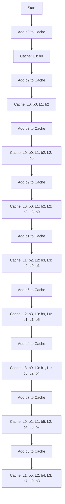

Continued from [[Computer Organization and Architecture Lecture 13]]
# Computer Organization & Architecture Lecture 14
Consider a fully associative cache memory with 4 lines that implements FIFO cache replacement policy. For the following block requests
2,3,4,7,6,3,4,7,5,4,7,8
Here's a markdown note summarizing the content from the diagrams:

---

### Memory Management

- **Offset Addressing:**
    - Refers to giving directions based on the reference memory address.
- **Memory Unit:**
    - The **Memory Management Unit (MMU)** converts the virtual memory address into the physical memory address.
- **Virtual and Physical Address Mapping:**
    - **Virtual Page Number + Offset** = Actual Page Number
    - The CPU searches for memory addresses in secondary memory (virtual memory), and it adds the reference memory address to the virtual address for the actual memory address.

---

### Cache Replacement Algorithms

- **Basic Concept:**
    - When the CPU demands a block and the cache is full, we need to replace one of the existing blocks.
- **Direct Mapping:**
    - Does not work with replacement algorithms because each block is fixed to a particular line in direct mapping.
- **Associative Mapping:**
    - The block has a chance to be placed in any line in the cache.
- **Set Associative Mapping:**
    - Similar to Associative Mapping but with sets instead of individual lines.

---

### FIFO (First in, First out) Algorithm

- **Processor Block Demand Example:**
    - b0, b2, b3, b9, b1, b5.
- **Cache Mapping (FIFO):**
    - L0: b1
    - L1: b5
    - L2: b4
    - L3: b9
- **Miss Calculation:**
    - For a fully associative cache memory with 4 lines, the following block requests will result in:
        - Misses: 7 out of 12 block requests.
- **Miss and Hit Ratios:**
    - **Miss Ratio (M.R.) =** 58.33%
    - **Hit Ratio (H.R.) =** 41.67%

---

### LIFO (Last in, First out) Algorithm

- Similar to FIFO, but the order of replacement differs based on the last loaded item being replaced first.

---

### Table Summary

|Algorithm|Misses|Hits|Miss Ratio (%)|Hit Ratio (%)|
|---|---|---|---|---|
|FIFO|7|5|58.33|41.67|

---
### 3) MRU (Most Recently Used)

**Block Request** → 1, 2, 3, 4, 5, 1, 2, 3, 4, 1, 2

| Block      | Step |
|------------|------|
| b1         | 1    |
| b2         | 2    |
| b3         | 3    |
| ~~b4~~ ~~b5~~ b4 | 4    |

**5 hits and 6 misses (4 essential misses, 2 capacity filled misses)**

- H.R = 5/11 = 0.4545 * 100 = 45.45%
- M.R = 100 - 45.45 = 54.55%

---

### 4) LRU (Least Recently Used)

**Block Request** → 0, 1, 2, 3, 4, 2, 3, 1, 5, 6

| Block      | Step |
|------------|------|
| b0         | 0    |
| b1         | 1    |
| b2         | 2    |
| ~~b3~~ ~~b4~~ b2 | 3    |

---
Flowchart for question 1

# References

###### Information
- date: 2025.03.05
- time: 09:27
- Continued To [[Computer Organization and Architecture Lecture 15]]