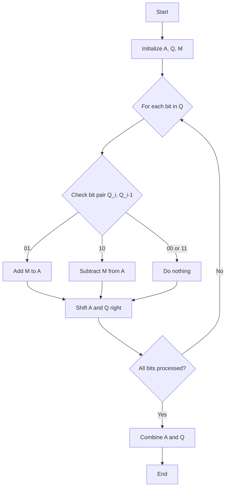

# Computer Organization and Architecture Lecture 17

# Main note

The multiplication of the two numbers 8*567 = 4536

The answer is [80,4,4,2] , here each index represents the location of the number in the order starting from index 0.

Let us move on with the explanation for booths algorithm

# Booth's Algorithm for Multiplication

Booth's algorithm is an efficient multiplication algorithm that is particularly useful in digital systems for multiplying two signed binary numbers in two's complement notation. It reduces the number of partial products by half compared to the traditional shift-and-add method.

## Manual Multiplication

To understand Booth's algorithm, let's first review how we manually multiply two numbers. Consider multiplying two decimal numbers, say 123 and 456.
$$
\begin{array}{r}
    123 \\
  \times 456 \\
  \hline
    738 \\
  61500 \\
+ 49200 \\
  \hline
  56088 \\
\end{array}
$$
We can also interpret the above as follows:

$$
\begin{array}{r}
    123 \\
  \times 456 \\
  \hline
    738 \quad \text{(123 $\times$ 6)} \\
   6150 \quad \text{(123 $\times$ 5, shifted left by 1 position)} \\
+ 49200 \quad \text{(123 $\times$ 4, shifted left by 2 positions)} \\
  \hline
   56088 \\
\end{array}
$$

In this manual multiplication:
1. Multiply 123 by each digit of 456.
2. Shift the result leftward according to the position of the digit in 456.
3. Add the results.

## Shifts in Multiplication

In binary multiplication, similar steps are involved, but with bitwise shifts. For example, multiplying 1011 (11 in decimal) by 110 (6 in decimal):
$$
\begin{array}{r}
    1011_2 \\
  \times 110_2 \\
  \hline
    0000_2 \\
   10110_2 \\
+ 101100_2 \\
  \hline
  1001010_2 \\
\end{array}
$$
Similarly, we can interpret the above as follows:

$$
\begin{array}{r}
    1011_2 \\
  \times 110_2 \\
  \hline
    0000 \quad \text{(1011 $\times$ 0, shifted left by 0 positions)} \\
   10110 \quad \text{(1011 $\times$ 1, shifted left by 1 position)} \\
+ 101100 \quad \text{(1011 $\times$ 1, shifted left by 2 positions)} \\
  \hline
  1001010_2 \quad \text{(66 in decimal)} \\
\end{array}
$$

## Booth's Algorithm Overview
Booth's algorithm improves upon this by reducing the number of partial products. It uses a combination of addition, subtraction, and shifts based on the examination of pairs of bits.
### Steps in Booth's Algorithm
1. **Initialization**:
   - Append a 0 to the least significant bit (LSB) of the multiplier (Q).
   - Initialize the accumulator (A) to 0.
   - Initialize the multiplicand as M.

2. **Iteration**:
   - For each bit in the multiplier (including the appended 0):
     - If the current bit pair (Q_i, Q_i-1) is 01, add M to A.
     - If the current bit pair (Q_i, Q_i-1) is 10, subtract M from A.
     - If the current bit pair (Q_i, Q_i-1) is 00 or 11, do nothing.
     - Shift A and Q one bit to the right. The LSB of A is shifted into the MSB of Q.

3. **Completion**:
   - After processing all bits, the result is in A and Q combined.

### Example Using Booth's Algorithm
Let's multiply 5 (0101) by 3 (0011) using Booth's algorithm:

- Initialization:
  - M = 0101
  - Q = 00110 (appended 0)
  - A = 00000

- Iteration:

| Step | Q        | A        | Operation   |
|------|----------|----------|-------------|
| 1    | 00011    | 00000    | Do nothing  |
| 2    | 00001    | 00000    | Add M       |
| 3    | 00000    | 00101    | Do nothing  |
| 4    | 10000    | 00010    | Subtract M  |
| 5    | 01000    | 00001    | Add M       |

- Result: AQ = 00001 0111 = 00001011 (11 in decimal)

## Implementation with Shift Registers and AND Gate

Booth's algorithm can be implemented using shift registers and an AND gate for multiplication. The shift registers hold the multiplicand, multiplier, and the accumulator. The AND gate is used to perform the addition or subtraction based on the bit pairs.

## Flowchart in Mermaid

## Solving Example Problems

### Example 1: Multiply 5 (0101) by -3 (1101 in two's complement)

- Initialization:
  - M = 0101
  - Q = 11010 (appended 0)
  - A = 00000

- Iteration:

| Step | Q        | A        | Operation   |
|------|----------|----------|-------------|
| 1    | 11101    | 00000    | Subtract M  |
| 2    | 01110    | 11101    | Add M       |
| 3    | 00111    | 01000    | Add M       |
| 4    | 10011    | 01011    | Subtract M  |
| 5    | 11001    | 11100    | Subtract M  |

- Result: AQ = 11100 1011 = -15 in decimal

### Example 2: Multiply -5 (1011) by 3 (0011)

- Initialization:
  - M = 1011
  - Q = 00110 (appended 0)
  - A = 00000

- Iteration:

| Step | Q        | A        | Operation   |
|------|----------|----------|-------------|
| 1    | 00011    | 00000    | Do nothing  |
| 2    | 00001    | 00000    | Add M       |
| 3    | 00000    | 10110    | Do nothing  |
| 4    | 10000    | 01011    | Subtract M  |
| 5    | 01000    | 00101    | Add M       |

- Result: AQ = 00101 1001 = -15 in decimal

This completes the explanation of Booth's algorithm for multiplication, including manual multiplication, the algorithm steps, implementation with shift registers, a flowchart, and example problems.
# References

###### Information
- date: 2025.03.08
- time: 16:28