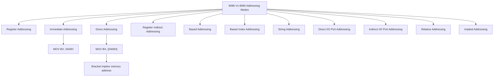
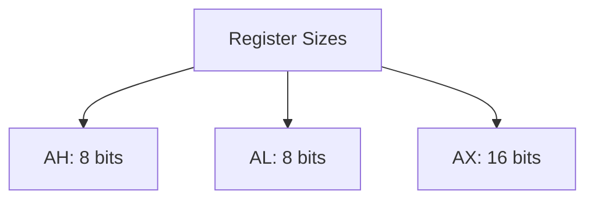

# 8086 Microprocessor
<center>

</center>

8086 Microprocessor is an enhanced version of 8085Microprocessor that was designed by Intel in 1976.
- It is a 16-bit Microprocessor having 20 address lines 
- 16 data lines 
- provides up to 1MB storage. 
It consists of powerful instruction set, which provides operations like multiplication and division easily.

### Features of 8086 
features of a 8086 microprocessor are as follow:- 
- It has an instruction queue
- capable of storing six instruction bytes from the memory resulting in faster processing.
- first 16-bit processor
	- 16-bit ALU
	- 16-bit registers
	- internal data bus
	- 16-bit external data bus
- It is available in 3 versions based on the frequency of operation 
    - 8086 → 5MHz
    - 8086-2 → 8MHz
    - (c)8086-1 → 10 MHz
- two stages of pipelining to improve performance
	- Fetch Stage
	- Execute Stage
- Fetch stage can prefetch up to 6 bytes of instructions and stores them in the queue.
- Execute stage executes these instructions.
- Has 256 vectored interrupts
- Composed out of 29,000 transistors


#### 8086 Vs 8085

CLC= Clear Carry Flag
1. Register Addressing
	1. MOV BX, CX
	2. Put the data of CX in BX
2. Immediate Addressing
	1. MOV BX, 0400H
	2. Put the data @ 0400H at BX
3. Direct Addressing 
	1. MOV BX, \[0400H\]
	2. Put the data in the address stored at \[0400H\] in BX
	3. Bracket implies memory address
4. Register Indirect Addressing
	1. MOV BX, \[CX\]
	2. Register points to an address
	3. Put the data at the address in the register \[CX\] in BX
5. Based Addressing
	1. MOV AX, \[BX+08H\]
		1. The source is an address + offset
	2. Suppose BX = 1000H we just add the offset to it and get the address
	3. So ultimately Source is 1008H
6.  Index Addressing
	1. SI Means Source Index. 
	2. MOV CX, \[SI+0A2H\]
	3. A2H = 11010010
	4. We need to extend it by 1s because sign bit is 1 here
	5. **CHECK WHY SIGN BIT Extends 1**
8. Based Index Addressing. 
9. String Addressing
10. Direct I/O Port Addressing
11. Indirect I/O Port addressing
12. Reltaive Addressing
13. Implied Addressing

# 8086 Microprocessor Instructions

## Conditional Transfers

| Instruction | Description                                      |
|-------------|--------------------------------------------------|
| `JA`        | Jump if above (unsigned)                          |
| `JAE`       | Jump if above or equal (unsigned)                |
| `JB`        | Jump if below (unsigned)                         |
| `JBE`       | Jump if below or equal (unsigned)               |
| `JC`        | Jump if carry                                   |
| `JE`        | Jump if equal                                   |
| `JG`        | Jump if greater (signed)                        |
| `JGE`       | Jump if greater or equal (signed)               |
| `JL`        | Jump if less (signed)                           |
| `JLE`       | Jump if less or equal (signed)                  |
| `JNA`       | Jump if not above (unsigned)                    |
| `JNAE`      | Jump if not above or equal (unsigned)           |
| `JNB`       | Jump if not below (unsigned)                    |
| `JNBE`      | Jump if not below or equal (unsigned)           |
| `JNC`       | Jump if not carry                               |
| `JNE`       | Jump if not equal                               |
| `JNG`       | Jump if not greater (signed)                   |
| `JNGE`      | Jump if not greater or equal (signed)            |
| `JNL`       | Jump if not less (signed)                       |
| `JNLE`      | Jump if not less or equal (signed)               |
| `JNO`       | Jump if not overflow                            |
| `JNP`       | Jump if not parity                              |
| `JNS`       | Jump if not sign                                |
| `JNZ`       | Jump if not zero                                |
| `JO`        | Jump if overflow                                |
| `JP`        | Jump if parity                                  |
| `JS`        | Jump if sign                                    |
| `JZ`        | Jump if zero                                    |

## Other Instructions

| Instruction | Description                                      |
|-------------|--------------------------------------------------|
| `MOV`       | Move data from source to destination            |
| `PUSH`      | Push data onto the stack                        |
| `POP`       | Pop data from the stack                         |
| `CALL`      | Call a procedure                                |
| `RET`       | Return from a procedure                         |
| `INT`       | Software interrupt                              |
| `IRET`      | Interrupt return                                |
| `LOOP`      | Loop according to CX register                   |
| `LOOPZ`     | Loop if zero                                    |
| `LOOPNZ`    | Loop if not zero                               |
| `MUL`       | Unsigned multiply                               |
| `DIV`       | Unsigned divide                                 |
| `SHR`       | Shift right                                     |
| `OR`        | Logical OR                                      |
| `NOT`       | Logical NOT                                     |
| `AND`       | Logical AND                                     |
| `XOR`       | Logical XOR                                     |
| `NEG`       | Two's complement negation                       |

## Arithmetic Instructions

| Instruction | Description                                      |
|-------------|--------------------------------------------------|
| `ADD`       | Add                                              |
| `SUB`       | Subtract                                         |
| `INC`       | Increment                                        |
| `DEC`       | Decrement                                       |
| `CMP`       | Compare                                         |
| `ADC`       | Add with carry                                  |
| `SBB`       | Subtract with borrow                            |

## Logical Instructions

| Instruction | Description                                      |
|-------------|--------------------------------------------------|
| `TEST`      | Logical compare                                 |

## Shift and Rotate Instructions

| Instruction | Description                                      |
|-------------|--------------------------------------------------|
| `SHL`       | Shift left                                       |
| `SAL`       | Shift arithmetic left                           |
| `SHR`       | Shift right                                      |
| `SAR`       | Shift arithmetic right                          |
| `ROL`       | Rotate left                                     |
| `ROR`       | Rotate right                                    |
| `RCL`       | Rotate through carry left                       |
| `RCR`       | Rotate through carry right                      |

## String Instructions

| Instruction | Description                                      |
|-------------|--------------------------------------------------|
| `MOVS`      | Move string                                      |
| `CMPS`      | Compare string                                  |
| `SCAS`      | Scan string                                      |
| `LODS`      | Load string                                      |
| `STOS`      | Store string                                    |

## Control Transfer Instructions

| Instruction | Description                                      |
|-------------|--------------------------------------------------|
| `JMP`       | Jump                                             |
| `CALL`      | Call procedure                                   |
| `RET`       | Return from procedure                           |
| `INT`       | Interrupt                                       |
| `IRET`      | Interrupt return                                |

## Flag Control Instructions

| Instruction | Description                                      |
|-------------|--------------------------------------------------|
| `CLC`       | Clear carry flag                                |
| `CMC`       | Complement carry flag                           |
| `STC`       | Set carry flag                                  |
| `CLD`       | Clear direction flag                             |
| `STD`       | Set direction flag                              |
| `CLI`       | Clear interrupt flag                            |
| `STI`       | Set interrupt flag                              |

## Miscellaneous Instructions

| Instruction | Description                                      |
|-------------|--------------------------------------------------|
| `NOP`       | No operation                                     |
| `HLT`       | Halt                                            |
| `WAIT`      | Wait                                            |
| `ESC`       | Escape to external processor                     |
| `LOCK`      | Lock bus                                        |

## Other Instructions

| Instruction | Description                                      |
|-------------|--------------------------------------------------|
| `MOV`       | Move data from source to destination            |
| `PUSH`      | Push data onto the stack                        |
| `POP`       | Pop data from the stack                         |
| `CALL`      | Call a procedure                                |
| `RET`       | Return from a procedure                         |
| `INT`       | Software interrupt                              |
| `IRET`      | Interrupt return                                |
| `LOOP`      | Loop according to CX register                   |
| `LOOPZ`     | Loop if zero                                    |
| `LOOPNZ`    | Loop if not zero                               |
| `MUL`       | Unsigned multiply                               |
| `DIV`       | Unsigned divide                                 |
| `SHR`       | Shift right                                     |
| `OR`        | Logical OR                                      |
| `NOT`       | Logical NOT                                     |
| `AND`       | Logical AND                                     |
| `XOR`       | Logical XOR                                     |
| `NEG`       | Two's complement negation                       |

## Addressing Mode MEmory access


---
All the registers are maximum 16 bits. Physical address is 20 bit. 

There is 4 bit shortage. Bus interface unit has an address generator it generates a 20 bit address from 16 bit physical address. 

Offset value is 16 bits
Segment register is 16 bit takes in hexadecimal values
example 1000H means 8 bits.
Adding 1 extra 0 after 1000**0** means 4 extra 0's in binary because 1 hexadecimal value means 4 bits in binary. 
So the segment register does a 4 times left shift.

Offset means Deviation
Example : If you say 10 meters left from cooper is MPSTME then the auto will go to cooper and then deviate itself 10 meters left to arrive at destination

AH, AL is 8 bits
AX is 16 bits

### MOV destination, Source
Instruction Specifies will specif the name of te register that holds the data to be operated by the instruction
Move means copy not cut its over written at destination

Example MOV DL, 08H
THe 8 bit data in $08_h$ in the instruction is moved to DL

- Direct Addressing


- Model 
- Stack 100H
- Data
	- Char 1 DB 'A'
	- num1 DB 25
- CODE
- STARTUP
	- MOV AL, Char1;
	- MOV BL, Num1;
	- MOV AH, 4CH;
	- INT 21H;
- END


- Model 
- Stack 100H
- Data
	- num32 DD 12345678H;
- CODE
- STARTUP
	- MOV AX, WORD PTR NUM32;
	- MOV DX, WORD PTR NUM3272;
- END


## References
- [Tutorials Point 8086](https://www.tutorialspoint.com/microprocessor/microprocessor_8086_addressing_modes.htm)

### 🛠️ **8086 Vs 8085 Addressing Modes**

#### **1. Addressing Modes**




---

### ⚙️ **Addressing Mode Memory Access**

- All the registers are a maximum of **16 bits**, but the **physical address** is **20 bits**.
    
- There is a **4-bit shortage**.
    
- The **Bus Interface Unit (BIU)** has an **address generator** that generates a **20-bit address** from a **16-bit physical address**.
    

#### **Physical Address Generation**

- **Offset value** → 16 bits
    
- **Segment register** → 16 bits (accepts hexadecimal values)
    
- Example: `1000H`
    
    - `1000H` = 8 bits in hexadecimal.
        
    - Adding **1 extra `0`** after `1000` → `10000H`
        
    - This equates to **4 extra `0`s** in binary, as **1 hex digit = 4 bits**.
        
    - Thus, the **segment register** performs a **4-times left shift**.
        

---

### 🔧 **Register Sizes**



---

### 🔥 **MOV Destination, Source**

- **MOV** specifies the register name that holds the data to be operated by the instruction.
    
- **Move** → Means **copy**, not cut; the value is **overwritten at the destination**.
    

#### **Example**

```assembly
MOV DL, 08H  
```

- The **8-bit data** `08H` is moved to the `DL` register.
    

---


## TASM Interface
Assembler directives provide instructions to the assembler, whereas other instructions discussed earlier provide instructions to the 8086 microprocessor. These directives are special instructions for the assembler, not for the processor. When writing a program in assembly language, you are writing for the assembler, not directly for the processor. The assembler needs to know about variable declarations and the space allocated for them. The processor does not concern itself with these details.
### Turbo Assembler (TASM)
- **Turbo C Compiler**: Used for C programming.
- **TASM**: Used for Assembly programming.
### Assembler Directives
Assembler directives set the outline for the computer program. They specify which registers to use and how to organize the code and data segments.
#### `ASSUME` Directive

The `ASSUME` directive informs the assembler about the association between segments and registers. It helps the assembler generate the correct code and symbol references.
What segment data is register

```assembly
ASSUME CS:CODE, DS:DATA

CODE SEGMENT
    ; Code goes here
    START:
    MOV AX, DATA
    MOV DS, AX
    ; Additional code...
CODE ENDS

DATA SEGMENT
    ; Data goes here
    MESSAGE DB 'Hello, World!$'
    NUMBER DW 1234H
DATA ENDS

END START
```

### Explanation
- **`ASSUME CS:CODE, DS:DATA`**: Tells the assembler that the `CS` register is associated with the `CODE` segment and the `DS` register is associated with the `DATA` segment.
- **`CODE SEGMENT`**: Defines the start of the code segment where executable instructions are placed.
- **`DATA SEGMENT`**: Defines the start of the data segment where variables and data are stored.
- **`START:`**: A label marking the entry point of the program.
- **`MOV AX, DATA` and `MOV DS, AX`**: Instructions to initialize the `DS` register with the address of the data segment.
- **`MESSAGE DB 'Hello, World!$'`**: Defines a byte-sized variable `MESSAGE` initialized with the string "Hello, World!".
- **`NUMBER DW 1234H`**: Defines a word-sized variable `NUMBER` initialized with the hexadecimal value `1234H`.
- **`END START`**: Marks the end of the program and specifies the entry point.

This structure helps the assembler organize and generate the correct machine code for the 8086 microprocessor.

#### DD Directive
The DD ( Define Double Word ) Directive  is used to define a 32 bit ( 4 byte ) value or an array of double words in data section.
4 Bytes
```ASM
DATA SEGMENT
	myVar DD 12345678h
DATA ENDS
```

#### DB Directive
The DB is define byte directive which is used to defien a byte or an array of bytes in the data section
1 Bytes
```ASM
DATA SEGMENT
	myByte DB 50
	myString DB 'HELLO'
```

#### DQ Directive
8 bytes value or an array of quadwords in the data section
```asm
DATA SEGMENT
	myVar DQ 12345678h; Define a quadword with a large value 
DATA ENDS
```

## RISC
- It contains a lesser number of instructions
- Supports instruction Pipelining Increased execution speed
- Orthogonal instruction set
- Simple addressing modes
## CISC
- It contains a large number of instructions
- Complex addressing modes

## Compare RISC and CISC
- 
###### Information
- date: 2025.03.26
- time: 09:41