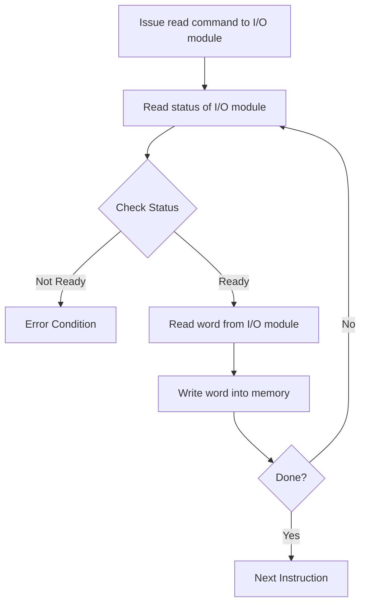

# Control Unit
Generates timing and control signals for the operations of the computer
Communicates to ALU
Transmission between the processor memory and various peripherals
Which Operation to be executed
Hardwired control
- Literal wires and components
- Hardware
- Memory is required is v less
Microprogrammed
- Use a program.
- Multiple programs comprise a big program
- Programs
- Needs Memory
The difference between hardwired control and microprogrammed is that hardwire doesnt have flexibility
a good amount of flexibility can be seen in microprogrammed

> [!WARNING]
> Questions frame from this data
> - what do u mean by hardwired control with block diagram

![[IMG-20250730000528715.png]]
## Hardwired
Gates Flip Flops etc 
Logic Gates, COunters, etc
Instruction Register
Current Instruction being executed

- [ ] ARM Research
Arduino is hardwired example
Programming activates the correct sequence of triggers

### What is subroutines

![[IMG-20250730000538801.png]]
## Two memory units
Main Memory - storing instructions and data
Control Memory - Storing the microprogra

PUR - Processor Unit Registor 
CUR - Control Unit Register Contains the 
CAR Control address register SBR Subroutine Register

Multiplexers
ALU

## Microprogrammed Controls
Micro Operations are low level instructions and operations that are used to make a more complex operation. Example Recursively Multiplying with subtraction to calculate a factorial.
Micro Instructions A symbolic microprogram into its binary equivalent is generated by assembler. Symbolic Micro operation representative. Label, CD, BR, AD.
It just tells to the assembles bout what to do before execution 

# I/O Modules Programmed I/O

> [!WARNING] 
> Question Type
> - I/O

Transfer two data from I/O to I/O
For a few times the cpu becomes the slave and dma becomes the master.

Condition Number 1

The DMA Returns one word at a time after which it must return the control of the buses to the CPU.
# References

###### Information
- date: 2025.04.03
- time: 11:06