# Digital Circuits to add and subtract

##  Prerequisites
- [[Full adders]]
- [[Full Subtractors]]

| Combinational | Sequential        |
| ------------- | ----------------- |
| No Memory     | Memory Required   |
| No feedback   | Feedback Required |
| Adder         | Flip Flop         |

---

## 4 Bit Binary Parallel Adder

The parallel adder solves the wait time due to non-serial additions.

### Full Adder with Primitive Logic

In the diagram, $\text{Full Adder} ~ FA_{2}$ can't work until $\text{Full Adder} ~ FA_{1}$ completes. This is because $FA_{2}$ is dependent on $FA_{1}$'s Carry Bit.

### Parallel Adder

The parallel adder depends on one crucial component: the **[Carry Look Ahead Adder (CLA)](https://www.geeksforgeeks.org/carry-look-ahead-adder/)**. Along with four other Full Adders, we have one extra **CLA**.

This is the $CLA$'s logic:

$$\begin{array}{c}
{S_{i} = P_{i} \oplus C_{i}} \\
{C_{i+1} = G_{i} + P_{i}C_{i}}
\end{array}$$

The IC 7483 uses the TTL 4-Bit Parallel binary adder chip. It contains four interconnected full-adders and a look-ahead carry circuitry for its operation.

### Multiplication of Two Bits

Imagine multiplying two bits $1001 \times 0101$:

$$
\begin{array}{c@{}c@{}c@{}c@{}c@{}c@{}c@{}c@{}c}
& & & &1 &0 &0 &1_2 \\
& & & \times & &0 &1 &0 &1_2 \\
\hline
& & & &1 &0 &0 &1_2 & & & \quad \text{(1001 $\times$ 1)} \\
& & &1 &0 &0 &1 & & & \quad \text{(1001 $\times$ 0, shifted left by 1)} \\
& &1 &0 &0 &1 & & & & \quad \text{(1001 $\times$ 1, shifted left by 2)} \\
+ &1 &0 &0 &1 & & & & & \quad \text{(1001 $\times$ 0, shifted left by 3)} \\
\hline
&1 &1 &0 &1 &0 &0 &1_2 \\
\end{array}
$$

This needs a huge amount of bits. Booth's algorithm solves this easily.

## Parallel Subtractor/Adder

### Full Subtractor Logic

A full subtractor is a digital circuit that performs subtraction on three one-bit binary numbers. It has three inputs: the minuend ($X$), the subtrahend ($Y$), and the borrow-in ($B_{in}$), and two outputs: the difference ($D$) and the borrow-out ($B_{out}$).

The logic for a full subtractor is as follows:

$$
\begin{array}{c}
{D = X \oplus Y \oplus B_{in}} \\
{B_{out} = \overline{X} \cdot Y + \overline{X} \cdot B_{in} + Y \cdot B_{in}}
\end{array}
$$

### Parallel Subtractor/Adder

A parallel subtractor/adder performs subtraction or addition on multiple bits simultaneously. It uses full adders or full subtractors arranged in parallel to handle each bit of the input numbers. The carry or borrow signals are propagated through the circuit to ensure correct arithmetic operations.

For a 4-bit parallel subtractor/adder, four full subtractors are used, each handling one bit of the 4-bit inputs. The borrow-out from one full subtractor is connected to the borrow-in of the next full subtractor, allowing the borrow signal to propagate through the circuit.

This arrangement ensures that the subtraction or addition operation is completed in a single clock cycle, making the parallel subtractor/adder much faster than serial implementations.

# Serial Adder
The serial adder revolves around a clock. The clock enables us to use a single adder to calculate the answre.
Thus this adder has only **one full adder**. We **store** the generated **Carry Bit** in a register called **Sum Register**. 
Once the clock moves on to the next one we **Shift Carry Register** to make space for next one. 
Then we calculate new carry bit and use previous to solve next bits output.

```mermaid
gantt
    title Serial Adder Process
    dateFormat  HH:mm
    axisFormat  %H:%M
    section Initialization
    Initialize Adder          :a1, 08:00, 1h
    section Bit Processing
    Load First Bits            :a2, after a1, 30m
    Calculate Sum and Carry    :a3, after a2, 30m
    Store Sum                  :a4, after a3, 15m
    Store Carry                :a5, after a4, 15m
    section Clock Shift
    Shift Carry Register       :a6, after a5, 15m
    section Next Bit Processing
    Load Next Bits             :a7, after a6, 30m
    Calculate New Sum and Carry :a8, after a7, 30m
    Store New Sum              :a9, after a8, 15m
    section Check Completion
    Check if All Bits Processed:a10, after a9, 15m
    section Final Output
    Output Final Sum           :a11, after a10, 15m
    section End
    End                        :a12, after a11, 15m

```

 