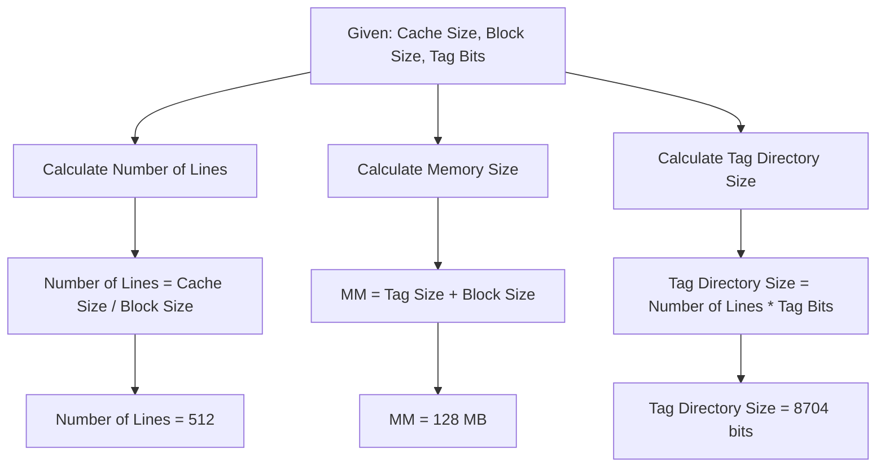
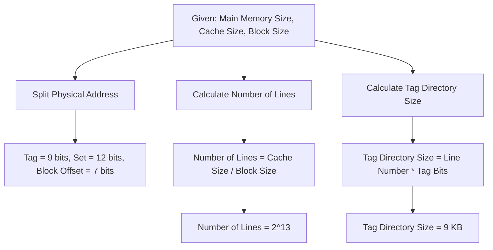

Continued from [[Computer Organization and Architecture Lecture 12]]
# Computer Organization & Architecture Lecture 13

In direct-mapped cache, each block of main memory is mapped to exactly one cache line. This means that the main memory is divided into blocks, and each block can only be placed in a specific cache line. Here's a breakdown of how the main memory address is distributed in a direct-mapped cache:

1. **Address Structure**:
   - The memory address is divided into three fields: tag, index, and offset (or block offset).

2. **Tag**:
   - The tag is the highest-order portion of the address. It is used to identify which memory block is currently stored in a cache line.

3. **Index**:
   - The index field determines the cache line where a memory block can be placed. In direct-mapped cache, each memory block maps to a unique cache line based on this index.

4. **Offset (Block Offset)**:
   - The offset specifies the particular word or byte within a block. It is used to access data within the block once it is loaded into the cache.

5. **Mapping Process**:
   - When a memory address is accessed, the index field is used to determine the cache line.
   - The tag of the memory address is compared with the tag stored in the cache line. If they match, it's a cache hit; otherwise, it's a cache miss.
   - In case of a cache miss, the block from main memory is loaded into the cache line specified by the index, potentially replacing the existing block.

6. **Example**:
   - Suppose you have a cache with 1024 lines and a block size of 64 bytes. If the main memory address is 32 bits:
     - The offset would be 6 bits (since \($2^6 = 64$\) bytes per block).
     - The index would be 10 bits (since $2^{10} = 1024$ cache lines).
     - The remaining bits $32 - 10 - 6 = 16$ bits would be the tag.

This structure ensures that each memory block has a fixed location in the cache, simplifying the cache management but potentially leading to more conflicts (collisions) compared to more complex cache mapping schemes like fully associative or set-associative caches.

# Problems and solutions

### **Question 1: Fully Associative Mapping**

#### **Given:**
- Cache Size: $C.S = 512 \, \text{KB} = 2^9 \times 2^{10} = 2^{19} \, \text{B}$
- Block Size: $B.S = 1 \, \text{KB} = 2^{10} \, \text{B}$
- Tag Bits: 17 bits

#### **Find:**
1. **Size of MM (Memory)**:
   $$
   \text{MM} = \text{Tag Size} + \text{Block Size} = 2^{17} + 2^{10} = 2^{27} = 128 \, \text{MB}
   $$
2. Line Size:
	 $$
	 \text{No of lines} = \frac{CS}{BS}=\frac{2^{19}}{2^{10}}=2^9
	 $$

3. **Tag Directory Size**:
   $$
   \text{Tag Directory Size} = \text{Line Number} \times \text{Tag Bits} = 2^9 \times 17 = 8704 \, \text{bits}
   $$

---

### **Question 2: Two-Way Set Associative Mapping**

#### **Given:**
- Main Memory Size: $256 \, \text{MB} = 2^{28} \, \text{B}$
- Cache Size: $1 \, \text{MB} = 2^{20} \, \text{B}$
- Block Size: $128 \, \text{B} = 2^7 \, \text{B}$

#### **Find:**
1. **P.A (Physical Address) Split**:
   $$
   \text{Tag} = 9 \, \text{bits}, \quad \text{Set} = 12 \, \text{bits}, \quad \text{Block Offset} = 7 \, \text{bits}
   $$
2. Line Number:
   - The number of lines in the cache is calculated by dividing the cache size by the block size.
   $$
   \text{Number of Lines} = \frac{\text{Cache Size}}{\text{Block Size}} = \frac{2^{20}}{2^7} = 2^{13}
   $$

4. **Tag Directory Size**:
   $$
   \text{Tag Directory Size} = \text{Line Number} \times \text{Tag Bits} = 2^{13} \times 17 = 9 \, \text{KB}
   $$

---

### **Question 3: 4-Way Set Associative Mapping**

#### **Given:**
- Main Memory Size: $4 \, \text{MB} = 2^{22} \, \text{B}$
- Block Size: $64 \, \text{B}$
- Tag Bits: 10
- Cache Size: $2 \, \text{KB}$

#### **Find:**
1. **Physical Address Split**:
   $$
   \text{Tag} = 10 \, \text{bits}, \quad \text{Set} = 2 \, \text{bits}, \quad \text{Block Offset} = 6 \, \text{bits}
   $$

3. **Cache Size**:
   $$
   \text{Cache Size} = \text{Number of Sets} \times \text{Set Size} \times \text{Block Size}
   = 2^6 \times 2^4 \times 2^8 = 16 \, \text{KB}
   $$

---

### **Question 4: Set-Associative Mapping (Main Memory and Cache Size Calculation)**

#### **Given:**
- Main Memory Size: $128 \, \text{KB}$
- Cache Size: $16 \, \text{KB}$
- Block Size: $256 \, \text{B}$

#### **Find the Cache Size for Different Set Associative Mappings:**
1. **For 2-Way Set Associative Mapping**:
   $$
   \text{Cache Size} = 64 \, \text{KB}
   $$

2. **For 4-Way Set Associative Mapping**:
   $$
   \text{Cache Size} = 256 \, \text{KB}
   $$

3. **For 8-Way Set Associative Mapping**:
   $$
   \text{Cache Size} = 4 \, \text{MB}
   $$

---

### **Table Diagram for Set Associative Mapping:**

#### **Two-Way Set Associative Mapping Table:**

| Set 0 | Set 1 |
| --- | --- |
| L0 | L1 |
| L2 | L3 |

---

#### **Physical Address Split for Set Associative Mapping:**

| Tag | Set | Block Offset |
| --- | --- | --- |
| 9 bits | 12 bits | 7 bits |

# References
Continued to [[Computer Organization and Architecture Lecture 14]]

###### Information
- date: 2025.02.27
- time: 11:12
