# Sequential Logic Circuits
- Memory exists
- Registers
	- Group of flip flops
	- Holds information
- Counters
	- A register that goes through a predetermined sequence of states

## High speed adders 
Assume that a sequential full adder takes 5 nano seconds to calculate addition. Then the next will take 10 ns. This cascading time is too huge for a sequential circuit.

```mermaid
gantt
    title Sequential Full Adder Timing
    dateFormat  X
    axisFormat %s ns

    section Addition Process
    First Addition  :done, 0, 5
    Second Addition :done, 0, 10
    Third Addition  :done, 0, 15
    Fourth Addition :done, 0, 20

```

</img>

To solve this problem we have carry look ahead adder that fetches $c_0$, $c_1$, $c_2$, $c_3$. The k map equations for carry look ahead is as follows.
$C_{i+1}=a_{i}.b_{i}+(a_{i})$
Here are the equations for a **Carry Look-Ahead Adder (CLA):**

1. **Generate and Propagate:**
    
$$    Gi=Ai⋅BiG_i = A_i \cdot B_i 
$$    $$Pi=Ai⊕BiP_i = A_i \oplus B_i$$
2. **Carry Equations:**
    
$$    Ci+1=Gi+(Pi⋅Ci)$$
$$    C_{i+1} = G_i + (P_i \cdot C_i) $$

$$    C_1 = G_0 + (P_0 \cdot C_0) $$

$$    C_2 = G_1 + (P_1 \cdot C_1) $$
$$$$
$$    C_3 = G_2 + (P_2 \cdot C_2)$$
$$    C4=G3+(P3⋅C3)$$

3. **Sum Equation:**
    
$$    Si=Pi⊕CiS_i = P_i \oplus C_i$$

# 8087 Math Co Processors
- Specially designed to do quick complex mathematical calculations
- Implemented to reduce work load on main processor 
- 8087 Shares same resources as the main
- Has 60 new instructions
- all new pneumonies begin with "F"/"E" to diff from main instructions
# References

###### Information
- date: 2025.03.11
- time: 08:35