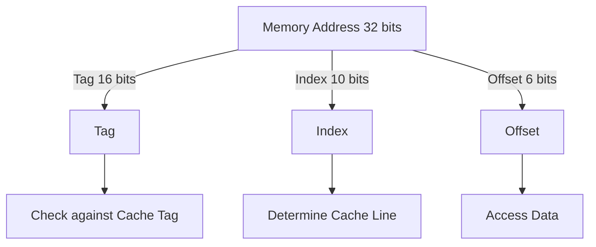
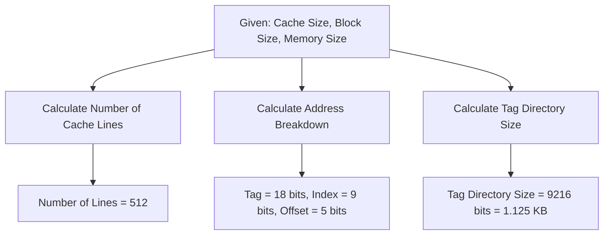
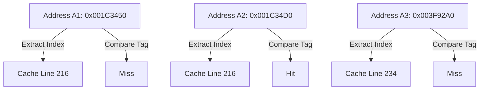

# Computer Organization & Architecture Lecture 14

## **Direct-Mapped Cache**

In **direct-mapped cache**, each block of main memory is mapped to exactly one cache line. This means that the main memory is divided into blocks, and each block can only be placed in a specific cache line. Below is a breakdown of how the main memory address is structured in direct-mapped cache:

### **1. Address Structure:**

- The memory address is divided into three fields:
    1. **Tag**
    2. **Index**
    3. **Offset (Block Offset)**

### **2. Components of Address**

1. **Tag:**
    - The highest-order bits of the address.
    - Used to determine whether the required memory block is currently stored in cache.
2. **Index:**
    - Used to identify the cache line where the memory block will be stored.
    - It is derived using modulo mapping.
3. **Offset (Block Offset):**
    - Determines the exact word or byte within a block.
    - Helps in accessing specific data inside the cache line.

### **3. Mapping Process**

1. When a memory address is accessed, the **index** field determines the cache line.
2. The **tag** of the memory address is compared with the tag stored in the cache line.
3. If the tags match → **Cache Hit** (data is found in the cache).
4. If the tags do not match → **Cache Miss** (block is fetched from main memory and stored in cache).
5. If a block is replaced, the previous block is removed from that cache line.

### **4. Example Calculation**

#### **Example: Cache with 1024 Lines and Block Size = 64 Bytes**

- **Given:**
    
    - Cache Lines = 1024 ($2^{10}$)
    - Block Size = 64 Bytes ($2^6$)
    - Memory Address = 32 bits
- **Address Breakdown:**
    
    - **Offset:** $2^6 = 64$ bytes → **6 bits**
    - **Index:** $2^{10} = 1024$ lines → **10 bits**
    - **Tag:** $32 - (10 + 6) = 16$ bits

---

## **Problems and Solutions**

### **Question 1: Direct-Mapped Cache Calculation**

#### **Given:**

- **Cache Size** = $16 , ext{KB} = 2^{14}$ Bytes
- **Block Size** = $32$ Bytes = $2^5$ Bytes
- **Memory Size** = $4 , ext{GB} = 2^{32}$ Bytes

#### **Find:**

1. **Number of Cache Lines:**
    
    extNumberofLines=Cache SizeBlock Size=21425=29=512 ext{Number of Lines} = \frac{\text{Cache Size}}{\text{Block Size}} = \frac{2^{14}}{2^5} = 2^9 = 512
2. **Address Breakdown:**
    
    - **Offset** = $5$ bits (since $2^5 = 32$ Bytes per block)
    - **Index** = $9$ bits (since $2^9 = 512$ cache lines)
    - **Tag** = $32 - (9+5) = 18$ bits
3. **Tag Directory Size:**
    
    extTagDirectorySize=extNumberofCacheLines×extTagBits=512×18=9216 bits=1.125KB ext{Tag Directory Size} = ext{Number of Cache Lines} \times ext{Tag Bits} = 512 \times 18 = 9216 \text{ bits} = 1.125 KB

---

### **Question 2: Cache Miss and Hit Analysis**

#### **Given:**

- **Cache Lines** = $1024$
- **Block Size** = $64$ Bytes
- **Memory Addresses**:
    - $A_1 = 0x001C3450$
    - $A_2 = 0x001C34D0$
    - $A_3 = 0x003F92A0$

#### **Find:**

- **Cache Line Number** for each address
- Whether each access is a **hit or miss**

#### **Solution:**

1. **Extract Index from Address:**
    
    - Index bits: **10 bits** (since $2^{10} = 1024$ lines)
    - Offset: **6 bits** (since block size is 64 bytes)
2. **Convert Addresses to Binary & Extract Index:**
    
    - $A_1$: **Index = (34D0)_h** → Cache Line **216**
    - $A_2$: **Index = (34D0)_h** → Cache Line **216** (Same line → HIT)
    - $A_3$: **Index = (92A0)_h** → Cache Line **234** (Different line → MISS)

---

### **Table Representation**

#### **Direct-Mapped Cache Example Table**

|Memory Address|Tag|Index|Offset|Cache Line|Hit/Miss|
|---|---|---|---|---|---|
|0x001C3450|0x001C|34D|50|216|Miss|
|0x001C34D0|0x001C|34D|D0|216|Hit|
|0x003F92A0|0x003F|92A|0|234|Miss|

---

# **References**

Continued to **[[Computer Organization and Architecture Lecture 15]]**

###### **Information**

- **Date:** 2025.03.17
- **Time:** 10:45