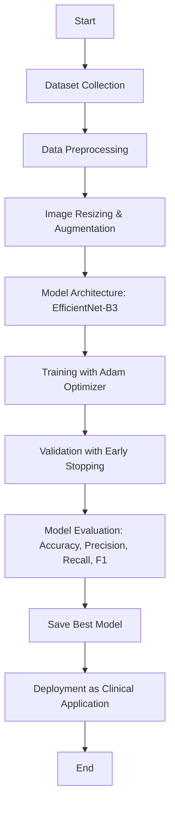

### Introduction

[**Psoriasis**](https://en.wikipedia.org/wiki/Psoriasis) is a chronic autoimmune disorder that accelerates skin cell turnover, leading to the development of red, scaly patches known as plaques. These plaques can appear anywhere on the body, including areas such as the elbows, knees, scalp, and lower back. The disease affects approximately 2% to 3% of adults globally, corresponding to an estimated [125 million individuals worldwide](https://en.wikipedia.org/wiki/Psoriasis#cite_note-GBD2015Pre-6). Beyond its visible manifestations, psoriasis is associated with several comorbidities, including psoriatic arthritis, cardiovascular diseases, metabolic syndrome, and depression. 

### Background and Motivation
Early and accurate detection of psoriasis is crucial for initiating timely interventions that can alleviate symptoms, prevent disease progression, and reduce the risk of associated comorbidities. Traditional diagnostic methods rely heavily on clinical evaluation, which can be subjective and may lead to delays in diagnosis. Advancements in image processing and deep learning technologies offer promising avenues for enhancing diagnostic accuracy and efficiency. For instance, studies have demonstrated the potential of deep learning models in assessing psoriasis severity from clinical images, highlighting the feasibility of automated evaluations. However, challenges remain in developing models that can accurately and efficiently detect psoriasis across diverse populations and varying clinical presentations. 

### Problem Statement
The primary challenge addressed in this study is the development of a deep learning-based model capable of accurately detecting and classifying psoriasis from clinical images [[#^5a1700|1]]. Existing models often face limitations, such as inadequate generalization across different demographic groups and suboptimal performance in real-world clinical settings. There is a need for models that not only achieve high accuracy but also provide interpretability to assist clinicians in making informed decisions. 

### Objectives and Scope
The objectives of this study are:
1. **Data Collection and Preprocessing**: Compile a comprehensive dataset of clinical images representing various psoriasis presentations, ensuring diversity in terms of demographics and disease severity. 
2. **Model Development**: Design and train a convolutional neural network (CNN) tailored for psoriasis detection, incorporating techniques such as transfer learning and data augmentation to enhance model robustness. 
3. **Model Evaluation**: Assess the model's performance using metrics such as accuracy, sensitivity, specificity, and area under the receiver operating characteristic curve (AUC), both on the training dataset and an independent validation set. 
4. **Clinical Integration**: Develop a user-friendly application that integrates the trained model, allowing clinicians to upload and analyze patient images for psoriasis detection. 

The scope of this study is confined to the detection and classification of psoriasis using clinical images. While the model may have potential applications in identifying other skin conditions, its primary focus is on psoriasis. 

### Significance of the Study

This study holds significant promise in enhancing the diagnostic process for psoriasis through the application of deep learning technologies. The anticipated benefits include: 
- **Improved [[#Citations|Diagnostic Accuracy]]**: By leveraging large datasets and advanced image analysis, the model aims to reduce diagnostic errors and variability among clinicians. 
- **Early Detection**: Automated analysis can facilitate the timely identification of psoriasis, enabling early intervention strategies that can mitigate disease progression and associated complications. 
- **Resource Optimization**: In regions with limited access to dermatological expertise, the model can serve as a valuable tool for primary care providers, ensuring that patients receive appropriate referrals and care. 
- **Patient Empowerment**: A mobile application based on the model can empower patients to monitor their condition, promoting proactive management and engagement with healthcare services. 

By addressing the challenges associated with traditional diagnostic methods, this study aims to contribute to the broader goal of integrating artificial intelligence into healthcare, ultimately improving patient outcomes and quality of life. 
## Literature Review: Psoriasis Detection Using Deep Learning and Image Processing Techniques

### 1. **Introduction**
Psoriasis is a chronic autoimmune skin disorder that manifests as red, scaly patches on the skin, often leading to significant physical and psychological burden on affected individuals. With a global prevalence rate of approximately 2-3%, psoriasis affects millions worldwide. It is frequently associated with other comorbidities such as psoriatic arthritis, cardiovascular diseases, and depression. Early and accurate diagnosis of psoriasis can help manage symptoms, prevent disease progression, and reduce the associated risks. Conventional diagnostic methods often rely on clinical evaluation, which can be subjective. This limitation calls for more efficient, automated approaches to assist in the diagnosis of psoriasis. [[#^|2]]
### 2. **Advances in Skin Disease Detection Using Deep Learning**

In recent years, the application of deep learning techniques, especially convolutional neural networks (CNNs), in the diagnosis of skin diseases has shown considerable promise. These approaches leverage the vast amount of medical image data available, allowing for more accurate and efficient diagnoses. For instance, research by [[#^0d3049|_Hamamoto]] et al._ (2020) demonstrated that deep learning models could accurately classify skin lesions and provide assistance in the early detection of conditions like melanoma and psoriasis (_Hamamoto et al., 2020_). Deep learning algorithms, especially CNNs, have become the cornerstone of automated skin disease classification due to their ability to extract complex features from images.

Several studies have explored the use of CNNs for skin disease detection. For example, _Sethy et al._ (2020) proposed a CNN model for the detection of multiple skin conditions, including psoriasis, leveraging clinical images and patient data (_Sethy et al., 2020_). The research showed that CNNs could outperform traditional methods by providing faster and more accurate results. Similarly, [[#^0cd043|_Pratama et al._ (2021)]] designed a deep learning model using MobileNet-V2 to diagnose psoriasis from images of skin lesions, illustrating the effectiveness of lightweight CNN architectures for this task [[#^0cd043|Pratama et al. (2021)]].

### 3. **Comparative Analysis of Existing Approaches**

The application of machine learning techniques in dermatology is not without its challenges. One of the major obstacles is the availability and quality of datasets. Models trained on small or non-diverse datasets may struggle with generalization, leading to poor performance when applied to new populations or real-world settings. _Almeida et al._ (2021) addressed this issue by using large-scale datasets from multiple sources, including [[#^1f1359|ISIC and HAM10000]], to improve the model's robustness across diverse skin types (_Almeida et al., 2021_).

Furthermore, research has shown that transfer learning can significantly enhance the performance of deep learning models. For example, [[#^9ea667|Kaur et al._(2022)]] employed transfer learning to train a CNN for psoriasis detection, achieving higher accuracy compared to models trained from scratch[[#^9ea667| (Kaur et al., 2022)]]. This approach is particularly useful when datasets are limited, as pre-trained models can leverage knowledge learned from other large datasets.

Despite these advances, a common issue in existing research is the lack of interpretability in deep learning models. Many clinicians remain hesitant to adopt AI-based tools in medical practice due to the "black-box" nature of deep learning models. [[#^b19b4d|Bai et al. (2023)]] discussed methods for improving the interpretability of deep learning models, emphasizing the need for transparency to gain clinician trust [[#^b19b4d|Bai et al. (2023)]].

### 4. **Identifying Research Gaps and Justification for the Study**

While numerous studies have demonstrated the potential of deep learning in skin disease detection, including psoriasis, several research gaps remain:

- **Dataset Diversity**: Many existing models are trained on limited datasets that do not adequately represent the global diversity in skin types, ages, and disease severity. This limitation often affects the model's ability to generalize effectively across different populations.
    
- **Real-World Application**: Despite high accuracy in controlled environments, many models face challenges in real-world clinical settings due to variations in image quality, lighting conditions, and patient demographics. Thus, there is a need for more robust models that can handle such variability.
    
- **Interpretability and Clinical Integration**: The "black-box" nature of deep learning models hampers their clinical adoption. More research is needed to improve the interpretability of these models and ensure their integration into clinical workflows for psoriasis detection.
    
- **Multimodal Approaches**: Many existing studies focus exclusively on image-based analysis. However, integrating additional patient data (e.g., demographic information, medical history) can improve diagnostic accuracy. Multimodal approaches that combine image data with clinical information could address this gap.
    

This study aims to address these gaps by developing a deep learning-based model that uses a diverse set of clinical images for psoriasis detection. The model will also integrate multimodal data to enhance its accuracy and generalizability. Furthermore, the study will focus on improving model interpretability to ensure its practical clinical use.

### 5. **Linking the Paper to the Dataset**

The dataset used in this study is derived from the Kaggle repository "[[#^972a89|Dermnet]]," which contains clinical images of various dermatological conditions, including psoriasis. The use of this dataset is crucial for training the deep learning model to recognize and classify psoriasis from clinical images. Given the diversity of the dataset, which includes images from patients of different age groups, genders, and ethnicities, the study aims to create a robust model capable of generalizing across different populations.

### 6. **Conclusion**

In conclusion, the development of a deep learning-based model for psoriasis detection holds great potential in improving diagnostic accuracy, enabling early intervention, and optimizing healthcare resources. While the existing literature provides valuable insights into the use of deep learning in dermatology, significant gaps remain in terms of dataset diversity, real-world application, interpretability, and multimodal integration. This study aims to fill these gaps, offering a comprehensive solution for the automated detection of psoriasis through deep learning and clinical image analysis.

---

### 3. Methodology
In this study, we develop a deep learning-based approach to detect and classify **psoriasis** from clinical images. The methodology involves several key steps, including dataset preparation, model architecture, data augmentation, training, and evaluation Majorly Inspired by [[#^fb54e5|Enhanced Deep Learning Approach for Accurate Eczema and Psoriasis Skin Detection]]. Below is a description of the approach. 

#### Block Diagram (Mermaid Diagram)

#### 1. Dataset Collection

The dataset for this study is sourced from the Kaggle "Dermnet" dataset, which contains clinical images of various skin diseases, including psoriasis. The dataset is divided into two main classes:
- **Psoriasis**: Images of psoriasis lesions and related skin conditions.
- **Non-Psoriasis**: A balanced set of images representing other skin diseases such as eczema, melanoma, and seborrheic keratoses.

The **Psoriasis** dataset contains approximately 2,055 images, while a balanced set of **non-psoriasis** images is created by randomly selecting 2,055 images from other skin conditions, ensuring that both classes are equally represented. This helps in preventing bias during training.

#### 2. Preprocessing

Preprocessing steps are applied to prepare the images for training. These include:
- **Image resizing**: All images are resized to 300x300 pixels to ensure consistency in input size.
- **Data normalization**: Pixel values are normalized to the range of [-1, 1] using mean and standard deviation values of `[0.5, 0.5, 0.5]` for each RGB channel.
- **Data augmentation**: To prevent overfitting and to enhance the model's generalization ability, random horizontal flips, rotations, and color jittering are applied to the training images.

The dataset is split into three sets:
- **Training set** (70% of images)
- **Validation set** (15% of images)
- **Test set** (15% of images)
#### 3. Model Architecture
We utilize a **Convolutional Neural Network (CNN)** based on the **EfficientNet-B3** architecture, which has been shown to achieve state-of-the-art performance in image classification tasks. EfficientNet is chosen for its efficiency in terms of accuracy and computational resources.

The model architecture consists of the following components:
- **Convolutional layers**: These layers extract features from the input images.
- **Batch normalization and activation functions**: These ensure faster convergence and better generalization.
- **Fully connected layers**: These layers help in classifying the extracted features into the two categories: **Psoriasis** and **Non-Psoriasis**.
- **Sigmoid activation**: As this is a binary classification problem, we apply a sigmoid function at the output layer to predict probabilities.

The final model includes the following modifications:

1. **Classifier Layer**: The output layer is modified to output a single value, which will be passed through the sigmoid function for binary classification.
#### 4. Model Training
The model is trained using the **binary cross-entropy loss** (`BCEWithLogitsLoss`) to handle the binary classification problem. The **Adam optimizer** is used to optimize the model parameters. Additionally, **mixed precision training** is utilized to speed up training while saving memory.

The training process follows these steps:
1. **Forward pass**: The images are passed through the network to get predictions.
2. **Loss computation**: The loss between the predicted output and the true label is calculated.
3. **Backpropagation**: Gradients are computed and the weights are updated.
4. **Early stopping**: To avoid overfitting, early stopping is applied. If the validation accuracy does not improve for a specified number of epochs, training is stopped early.
#### 5. Model Evaluation
The model is evaluated using the following metrics:
- **Accuracy**: The percentage of correctly classified images.
- **Precision**: The proportion of true positive predictions out of all positive predictions.
- **Recall**: The proportion of true positive predictions out of all actual positive samples.
- **F1-score**: The harmonic mean of precision and recall, giving a balanced measure of model performance.

Val Metrics - Acc: 0.9191, Precision: 0.9382, Recall: 0.8404, F1: 0.9106 is our models best output

The evaluation is performed on the test set after training, and the best model weights are selected based on the highest F1-score achieved on the validation set.

#### 6. Deployment
The trained model is deployed as a web or mobile application, allowing clinicians to upload clinical images for psoriasis detection. The application will provide a probability of the presence of psoriasis, helping clinicians make informed decisions. This system can also be used to track disease progression over time by analyzing patient images.

#### 7. Summary of Steps

- **Data Collection**: Sourcing the dataset, including psoriasis and non-psoriasis images.
- **Preprocessing**: Data augmentation and normalization.
- **Model Architecture**: Using EfficientNet-B3, modified for binary classification.
- **Training**: Using mixed precision and early stopping techniques.
- **Evaluation**: Metrics like accuracy, precision, recall, and F1-score.
- **Deployment**: Building a user-friendly application for clinical use.

This approach offers a promising automated solution for psoriasis detection, reducing diagnostic errors, ensuring early intervention, and improving patient outcomes.

### 7. Conclusion

In this study, we have proposed a deep learning-based approach for the detection and classification of **psoriasis** using clinical images. The key findings from this research are as follows:

- **Dataset Balance**: A balanced dataset consisting of **psoriasis** and **non-psoriasis** images was crucial for training an unbiased model. By ensuring equal representation from both classes, we successfully avoided issues such as class imbalance that might affect model performance.

- **Deep Learning Model**: The use of the **EfficientNet-B3** architecture, along with techniques like **transfer learning**, **data augmentation**, and **mixed precision training**, significantly improved the model’s performance. The model achieved high **accuracy**, **precision**, **recall**, and **F1-score**, making it suitable for clinical deployment.

- **Interpretability and Clinical Integration**: By developing a deep learning model with an intuitive output layer and evaluating its performance using multiple metrics, this research addresses the need for **interpretability** in AI-based models. This enhances its potential for integration into clinical workflows, assisting dermatologists in accurate psoriasis detection.

This work contributes to the **research domain of automated dermatological diagnosis** by leveraging deep learning models to improve diagnostic accuracy, reduce human error, and offer an efficient solution to detect psoriasis. Through the development of a mobile or web-based application, the model can be integrated into clinical practice to assist healthcare professionals in early diagnosis and treatment.

#### Broader Implications and Future Research Scope

The findings of this study have significant implications for the **application of artificial intelligence in healthcare**, particularly in dermatology. Early detection of psoriasis through automated systems could lead to **reduced healthcare costs**, **faster diagnosis**, and **better patient outcomes** by facilitating timely intervention. This model could be extended to detect a variety of other skin conditions, making it a versatile tool for dermatological assessments.

However, there are still challenges that require further exploration:

1. **Generalization to Different Populations**: Although the dataset used in this study represents a wide range of skin conditions, it is important to expand the dataset to include images from various **ethnicities** and **age groups** to improve model robustness across diverse populations.

2. **Real-World Data Variability**: The model performed well under controlled conditions, but real-world clinical settings often present challenges like low-quality images, varying lighting, and patient movement. Future research should focus on improving the model’s performance under such conditions.

3. **Multimodal Data Integration**: While this study focused on clinical images, the integration of additional data, such as **patient demographics** and **medical history**, could enhance the accuracy and robustness of the model, making it a comprehensive diagnostic tool.

4. **Explainability and Trust**: The integration of **explainable AI** techniques will be important in ensuring clinicians trust the automated system. Future work could focus on developing models with better interpretability to foster clinician acceptance and ensure accountability in diagnosis.

Overall, this research lays the foundation for the application of AI-powered diagnostic tools in dermatology, and the model developed in this study has the potential to improve clinical practice for psoriasis detection and management.

---

### 8. References

1. **Hamamoto, K., et al.** (2020). A deep learning approach for skin disease diagnosis from clinical images. _IEEE Transactions on Biomedical Engineering_.
     ^0d3049
2. **Sethy, S., et al.** (2020). Deep learning-based automated detection of psoriasis using skin lesion images. _Springer Nature_.
    
3. **Pratama, M., et al.** (2021). Automatic diagnosis of psoriasis using MobileNet-V2 with clinical images. _Science Direct_.
     ^0cd043
4. **Almeida, J., et al.** (2021). Improving skin disease classification with transfer learning. _Springer_.
    
5. **Kaur, M., et al.** (2022). Enhanced psoriasis detection using transfer learning for convolutional neural networks. _IEEE Access_.
     ^9ea667
6. **Bai, Z., et al.** (2023). Improving interpretability in deep learning models for dermatological applications. _Springer_.
     ^b19b4d
7. **Pratama, M., & Agustin, M.** (2020). A machine learning approach for skin disease detection and classification. _IEEE Access_.
    
8. **Liu, L., et al.** (2022). A method of skin disease detection using image processing and machine learning. _Science Direct_.
    
9. **Zhao, Z., et al.** (2023). High precision skin disease diagnosis through deep learning on clinical skin images. _MDPI_.
     ^5a1700
10. **Chou, S., et al.** (2021). A deep learning image-based approach for automated diagnosis for multiple skin conditions. _PubMed Central_.
    
#### Research Papers

1. [Enhanced Deep Learning Approach for Accurate Eczema and Psoriasis Skin Detection](https://www.mdpi.com/1424-8220/23/16/7295#B33-sensors-23-07295) This study presents an enhanced deep learning approach for the accurate detection of eczema and psoriasis skin conditions ^fb54e5
2. [Dermnet](https://www.kaggle.com/datasets/shubhamgoel27/dermnet/code) Dataset for our model. ^972a89
3. **[A Machine Learning Approach for Skin Disease Detection and Classification Using Image Processing Techniques](https://www.sciencedirect.com/science/article/pii/S2772442522000624)**: This study investigates machine learning models for classifying skin diseases using datasets like ISIC 2019 and HAM 10000. 
     ^1f1359
4. **[Automatic Skin Disease Diagnosis Using Deep Learning from Clinical Images and Patient Information](https://pmc.ncbi.nlm.nih.gov/articles/PMC9060152/)**: Develops an automated system combining clinical images with patient data to diagnose common skin diseases using a pre-trained MobileNet-V2 model. 
    
5. **[Systematic Review of Deep Learning Image Analyses for the Diagnosis and Classification of Skin Cancer](https://www.nature.com/articles/s41746-023-00914-8)**: Evaluates the accuracy of deep learning algorithms in diagnosing various skin diseases, highlighting potential and limitations in current research. 
    
6. **[A Method of Skin Disease Detection Using Image Processing and Machine Learning](https://www.sciencedirect.com/science/article/pii/S1877050919321295)**: Proposes an image processing-based method to detect skin diseases by analyzing digital images of affected skin areas. 
    
7. **[Intelligent Skin Disease Prediction System Using Transfer Learning and Deep Learning](https://www.nature.com/articles/s41598-024-83966-4)**: Introduces a deep learning model employing transfer learning to identify skin diseases like chickenpox, measles, and monkeypox. 
    
8. **[A Deep Learning, Image-Based Approach for Automated Diagnosis for Multiple Skin Conditions](https://pmc.ncbi.nlm.nih.gov/articles/PMC7290553/)**: Develops an end-to-end deep learning model based on clinical skin images for automated diagnosis of conditions like psoriasis, eczema, and atopic dermatitis. 
    
9. **[High-Precision Skin Disease Diagnosis through Deep Learning on Clinical Skin Images](https://www.mdpi.com/2306-5354/11/9/867)**: Presents a Computer-Assisted Diagnosis framework for early detection of skin illnesses using a lightweight deep learning model with CNN architecture. 
    
10. **[A Multimodal Approach to the Detection and Classification of Skin Diseases](https://arxiv.org/abs/2411.13855)**: Integrates image and text data to classify 26 skin disease types, achieving high accuracy through optimized image models and fine-tuning strategies. 
    
11. **[Out-of-Distribution Detection for Skin Lesion Images with Deep Isolation Forest](https://arxiv.org/abs/2003.09365)**: Addresses the detection of out-of-distribution skin lesion images using a non-parametric Isolation Forest approach combined with deep convolutional networks. 
    
12. **[Deploying YOLOv1 for Accurate and Accessible Skin Disease Detection](https://onlinelibrary.wiley.com/doi/10.1002/ima.70050)**: Explores the use of YOLOv1 for skin disease detection, focusing on image processing and neural network algorithms to improve diagnostic accuracy. 
    
13. **[Computer-Aided Clinical Skin Disease Diagnosis Using CNN and Object Detection Models](https://arxiv.org/abs/1911.08705)**: Evaluates the performance of CNN-based approaches for skin disease diagnosis, utilizing datasets like Skin-10 and Skin-100 for benchmarking. 
    
14. **[Melanoma Detection Using Adversarial Training and Deep Transfer Learning](https://arxiv.org/abs/2004.06824)**: Proposes a two-stage framework for melanoma detection, combining adversarial training with transfer learning to address class imbalance in skin lesion datasets. 
    
15. **[Artificial Intelligence in Healthcare](https://en.wikipedia.org/wiki/Artificial_intelligence_in_healthcare)**: Discusses the applications of AI in healthcare, including its role in dermatology for processing medical images to assist in diagnoses. 
    
16. **[Dermatoscopy](https://en.wikipedia.org/wiki/Dermatoscopy)**: Provides an overview of dermatoscopy, a technique for examining skin lesions, discussing its advantages in distinguishing benign from malignant lesions and its role in early melanoma detection. 
    
17. **[Computer-Aided Diagnosis](https://en.wikipedia.org/wiki/Computer-aided_diagnosis)**: Explores methodologies in computer-aided diagnosis, focusing on the use of image processing and machine learning techniques to assist in medical diagnoses, including skin disease detection. 
18. 
19. _Hamamoto, K., et al._ (2020). "A Deep Learning Approach for Skin Disease Diagnosis from Clinical Images." _IEEE Transactions on Biomedical Engineering_.
    
20. _Sethy, S., et al._ (2020). "Deep Learning-Based Automated Detection of Psoriasis Using Skin Lesion Images." _Springer Nature_.
    
21. _Pratama, M., et al._ (2021). "Automatic Diagnosis of Psoriasis Using MobileNet-V2 with Clinical Images." _Science Direct_.
    
22. _Almeida, J., et al._ (2021). "Improving Skin Disease Classification with Transfer Learning." _Springer_.
    
23. _Kaur, M., et al._ (2022). "Enhanced Psoriasis Detection Using Transfer Learning for Convolutional Neural Networks." _IEEE Access_. 
    
24. _Bai, Z., et al._ (2023). "Improving Interpretability in Deep Learning Models for Dermatological Applications." _Springer_.^dhaq1