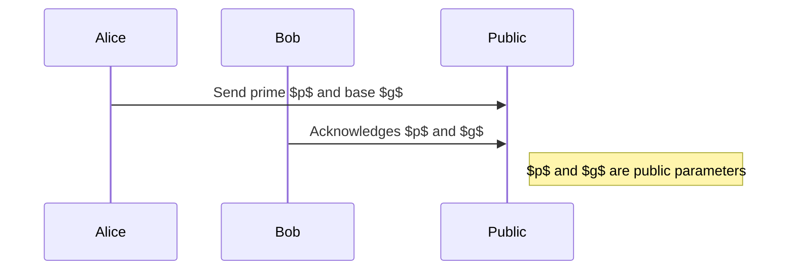
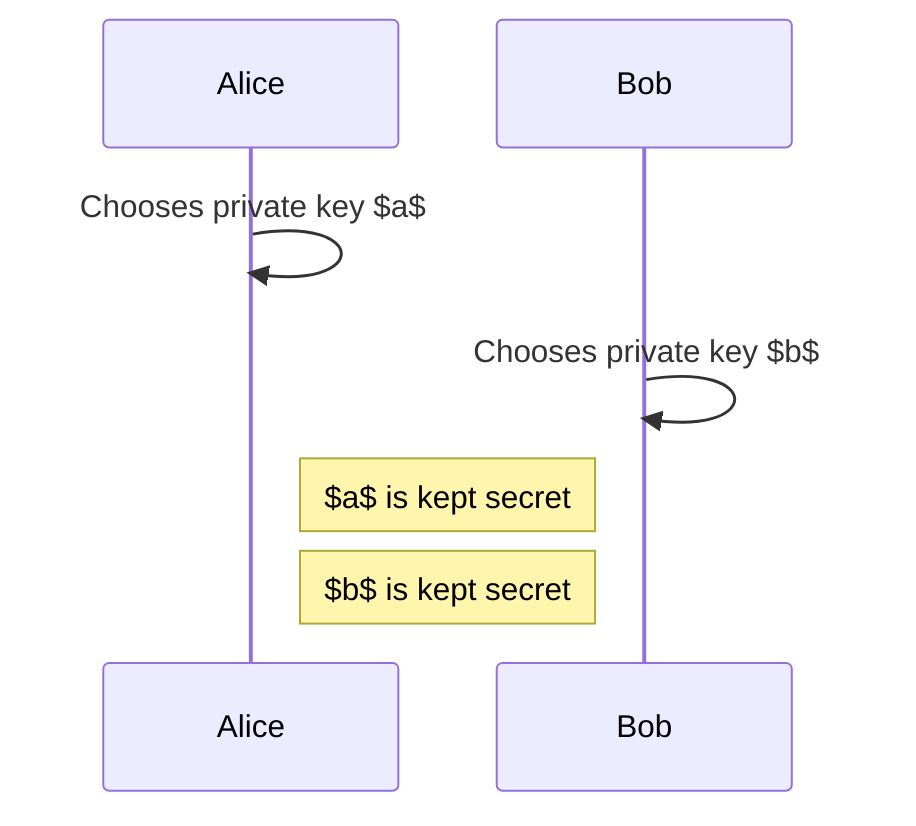
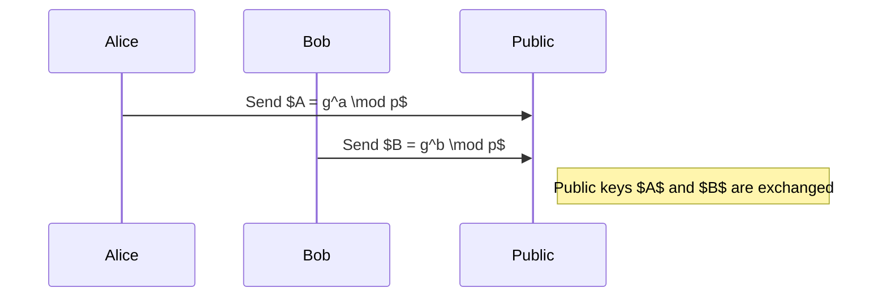
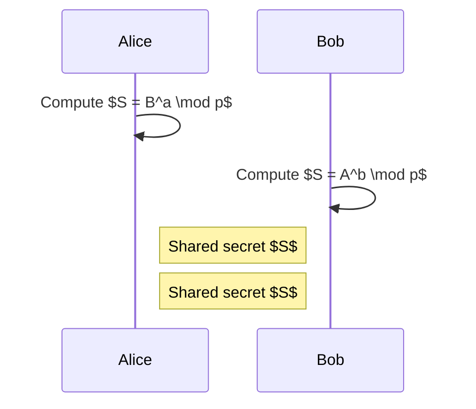

# Diffie-Hellman Key Exchange

## Introduction
The **Diffie-Hellman Key Exchange** was invented in **1976** by **Whitfield Diffie** and **Martin Hellman**. It is a cryptographic protocol that allows two parties to **create a shared secret** over an **insecure channel** without directly exchanging the secret itself.

---

## Color Analogy for Intuitive Understanding
To understand the concept visually, imagine the process of **mixing colors**:

### 1. **Shared Public Colors**
- Alice and Bob publicly agree on:
    - A **clear container** → represents the **prime number $p$**.
    - **Yellow paint** → represents the **generator $g$**.
- These **public colors** can be seen by everyone, including an attacker.

### 2. **Private Colors**
- Alice secretly chooses **red paint** → her **private key $a$**.
- Bob secretly chooses **blue paint** → his **private key $b$**.
- These **private colors** are never shared.

### 3. **Public Key Generation**
- Alice mixes her **red paint** with the **yellow paint** → creating **orange**.
- Bob mixes his **blue paint** with the **yellow paint** → creating **green**.
- They **exchange these mixed colors** publicly.

### 4. **Shared Secret Generation**
- Alice receives Bob's **green** and mixes it with her **red** → **brown**.
- Bob receives Alice's **orange** and mixes it with his **blue** → **brown**.
- Both end up with the **same brown color**, representing the shared secret.

### 🔥 **Why is it secure?**
- An attacker can **see the orange and green** but cannot determine the original **red and blue**.
- Since **color mixing cannot be easily reversed**, the attacker cannot recreate the shared **brown color** without the original private colors.

---

## Mathematical Steps

### 1. **Parameter Agreement**
Alice and Bob publicly agree on:
- A **large prime number** $p$ → the container.
- A **generator** $g$ → the yellow paint.

These values are public and can be shared openly.

---

### 2. **Private Key Generation**
- Alice selects a **private key** $a$.
- Bob selects a **private key** $b$.
- These values remain secret and are **never shared**.

---

### 3. **Public Key Calculation**
- Alice computes her **public key**:

$$
A = g^a \mod p
$$

- Bob computes his **public key**:

$$
B = g^b \mod p
$$

- Both send their **public keys** to each other.

---

### 4. **Shared Secret Calculation**
- Alice uses Bob's public key $B$ and her private key $a$:

$$
S = B^a \mod p = (g^b)^a \mod p
$$

- Bob uses Alice's public key $A$ and his private key $b$:

$$
S = A^b \mod p = (g^a)^b \mod p
$$

- Both end up with the **same shared secret** $S$.

---

## Example with Small Numbers
Let’s go through a simple example:
- $p = 23$ (public)
- $g = 5$ (public)
- Alice’s private key: $a = 6$
- Bob’s private key: $b = 15$

**Public Key Generation:**
- Alice computes:

$$
A = 5^6 \mod 23 = 8
$$

- Bob computes:

$$
B = 5^{15} \mod 23 = 19
$$

**Shared Secret Calculation:**
- Alice computes:

$$
S = 19^6 \mod 23 = 2
$$

- Bob computes:

$$
S = 8^{15} \mod 23 = 2
$$

Thus, **Alice and Bob now share the secret key $S = 2$**, which is never directly exchanged.

---

## Key Takeaway
The **Diffie-Hellman Key Exchange** enables two parties to securely generate a **shared secret** over an insecure channel.
- The security relies on the **difficulty of solving the discrete logarithm problem**.
- Even if an attacker intercepts all public information, they **cannot determine the shared secret** without solving the discrete logarithm, which is infeasible with large prime numbers.