# Cryptographic applications
> [!Related Notes]
> - [[Introduction, Security goals (CIA triad)]]
> - [[Goals of cryptography, principles of modern cryptography]]
> - [[Perfectly secret encryption, one time pad and Shannon's theorem]]

# Cryptographic Applications

Cryptography has numerous practical applications in our digital world, building on the [[Introduction, Security goals (CIA triad)\#The CIA Triad|CIA triad]] and implementing the [[Goals of cryptography, principles of modern cryptography|principles of modern cryptography]]. Some of the key applications include:

## E-commerce

Secure online transactions using encryption to protect financial data and sensitive information during payment processes. This includes:

- Encrypting credit card details
- Securing customer information
- Protecting transaction records
- Enabling secure online banking

## Digital Signatures

Authenticating digital documents and ensuring their integrity using cryptographic techniques to prevent forgery and tampering. Digital signatures provide:

- Proof of document origin
- Verification of document integrity
- Non-repudiation of signed content
- Legal validity in many jurisdictions

## Email Security

Protecting sensitive emails from unauthorized access using encryption algorithms to safeguard data and communication privacy. This includes:

- End-to-end encryption of email content
- Digital signatures for email authentication
- Protection against email interception
- Secure storage of email data

## Secure Communication

Enhancing security and privacy in communication channels like messaging apps and voice calls using encryption to safeguard conversations. This includes:

- End-to-end encrypted messaging
- Secure voice and video calls
- Protected group communications
- Secure file sharing

Other important applications include:

### Cryptocurrencies and Blockchain

Digital currencies and distributed ledger technologies rely heavily on cryptographic principles for:

- Transaction security
- Wallet protection
- Consensus mechanisms
- Smart contract execution

### Authentication Systems

Secure login and identity verification systems use cryptography for:

- Password hashing and storage
- Multi-factor authentication
- Single sign-on solutions
- Biometric verification

### Data Protection

Securing stored data through:

- Full disk encryption
- Database encryption
- Secure cloud storage
- Data loss prevention

Many of these applications implement [[Perfectly secret encryption, one time pad and Shannon's theorem|cryptographic algorithms]] based on the theoretical foundations established by Shannon and other cryptographers.

## Summary

```mermaid
graph TD
    A[Cryptographic Applications] --> B[E-commerce]
    A --> C[Digital Signatures]
    A --> D[Email Security]
    A --> E[Secure Communication]
    A --> F[Cryptocurrencies & Blockchain]
    A --> G[Authentication Systems]
    A --> H[Data Protection]
    
    B --> B1[Credit card encryption]
    B --> B2[Customer data security]
    B --> B3[Transaction protection]
    
    C --> C1[Document origin proof]
    C --> C2[Integrity verification]
    C --> C3[Non-repudiation]
    
    D --> D1[End-to-end encryption]
    D --> D2[Email authentication]
    D --> D3[Interception protection]
    
    E --> E1[Encrypted messaging]
    E --> E2[Secure calls]
    E --> E3[Protected file sharing]
    
    F --> F1[Transaction security]
    F --> F2[Smart contracts]
    F --> F3[Consensus mechanisms]
    
    G --> G1[Password hashing]
    G --> G2[Multi-factor auth]
    G --> G3[Biometric verification]
    
    H --> H1[Disk encryption]
    H --> H2[Database security]
    H --> H3[Secure storage]
    
    subgraph "Cryptographic Principles"
        I[Confusion & Diffusion]
        J[Symmetric Algorithms]
        K[Asymmetric Algorithms]
        L[Hash Functions]
    end
    
    I -.-> A
    J -.-> A
    K -.-> A
    L -.-> A
```

⁂

# References

###### Information
- date: 2025.04.19
- time: 11:54