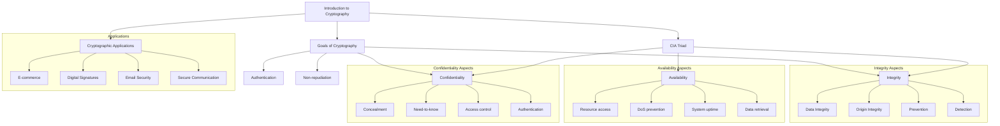

# Introduction to Cryptography

> [!Related Notes]
>
> - [[Introduction, Security goals (CIA triad)]]
> - [[Goals of cryptography, principles of modern cryptography]]
> - [[Cryptographic applications]]

Cryptography is a fundamental technology that protects sensitive information by transforming it into an unreadable format, ensuring its [[Introduction, Security goals (CIA triad)#The CIA Triad|confidentiality, integrity, and availability]]. It involves complex algorithms and mathematical principles to safeguard data from unauthorized access, modification, or disruption, enabling secure communication and transactions in the digital age.

Cryptography serves as the foundation for achieving the [[Goals of cryptography, principles of modern cryptography|goals of cryptography]] and enables various [[Cryptographic applications|cryptographic applications]] in our digital world.

## The CIA Triad

The CIA Triad consists of three key information security principles:

- **[[#Confidentiality|Confidentiality]]**
- **[[#Integrity|Integrity]]**
- **[[#Availability|Availability]]**

These three pillars form the foundation of information security and guide the development of security policies and controls.
### Confidentiality
Confidentiality involves ensuring that only authorized individuals have access to information. This includes:

- Concealment of information or resources
- "Need to know" basis for data access
- Preventing unauthorized disclosure of sensitive data (passwords, financial records, confidential communications)
- Protecting privacy and safeguarding trade secrets

**Approaches to ensure confidentiality:**

- Access control that specifies who can access what
- Identification and authentication to verify user identity
- Physical access controls for assets (e.g., computer room access)

Confidentiality is:

- Difficult to ensure
- Easiest to assess in terms of success

### Integrity

Integrity refers to maintaining the accuracy and consistency of information. This ensures that data remains unaltered and trustworthy.

**Types of integrity:**

- Data Integrity (the content of the information)
- Origin Integrity (source of data, often called authentication)

**Integrity Check Mechanisms:**

1. **Prevention Mechanisms**
    - Blocking unauthorized attempts to change data
    - Blocking attempts to change data in unauthorized ways
2. **Detection Mechanisms**
    - Reporting when data's integrity is no longer trustworthy

Integrity protects against:

- Malicious modifications
- Accidental errors
- Fraudulent activities

Evaluating integrity is very difficult as it relies on assumptions about the source of the data and trust in that source.
### Availability

Availability means making sure that information is accessible to authorized users when needed. This involves:

- Ability to use the information or resource desired
- Preventing denial-of-service attacks
- Ensuring data is stored and retrieved reliably
- Guaranteeing system uptime for business continuity and critical operations

System designs typically:

- Assume a statistical model to analyze expected patterns of use
- Implement mechanisms to ensure availability when that statistical model holds

Denial of Service attacks, which attempt to block availability, can be the most difficult to detect, especially when they manipulate use patterns or parameters that control use (such as network traffic).
## Summary

## Related Notes
- [[Goals of cryptography, principles of modern cryptography]]
- [[Perfectly secret encryption, one time pad and Shannon’s theorem]]
- [[Cryptographic applications]]

# References

###### Information
- date: 2025.04.19
- time: 11:43