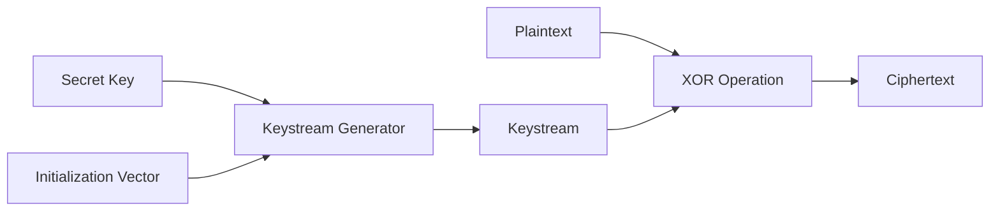
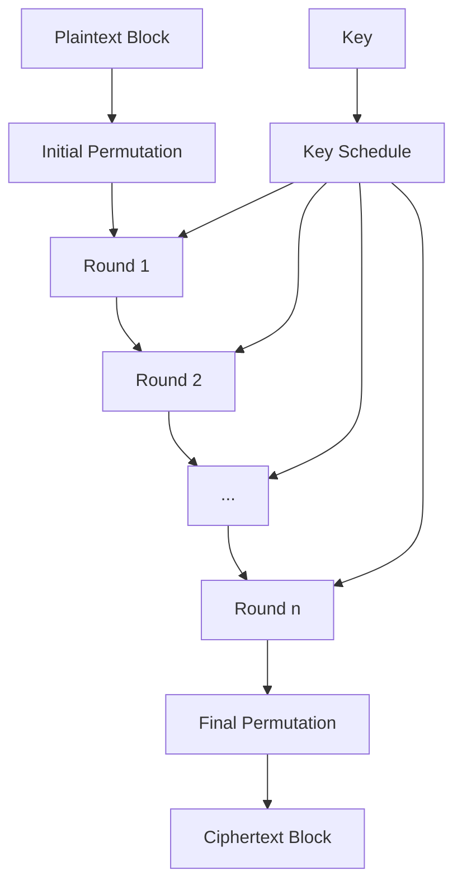
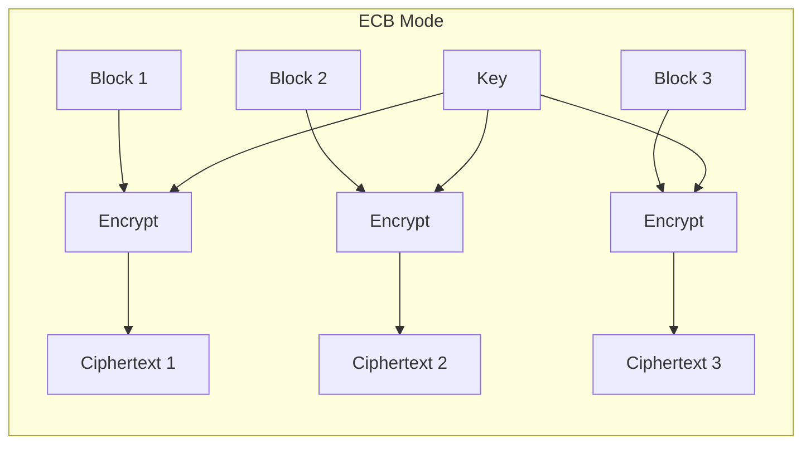
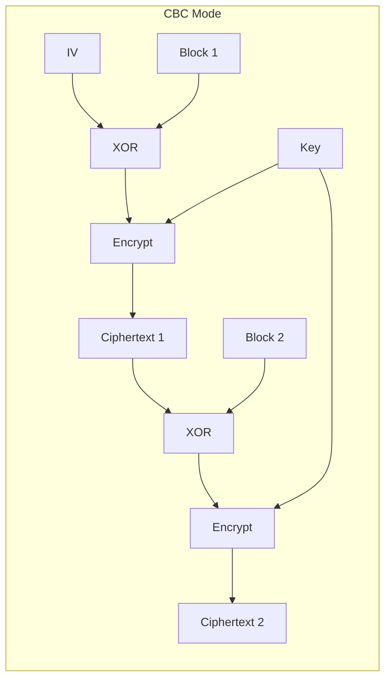
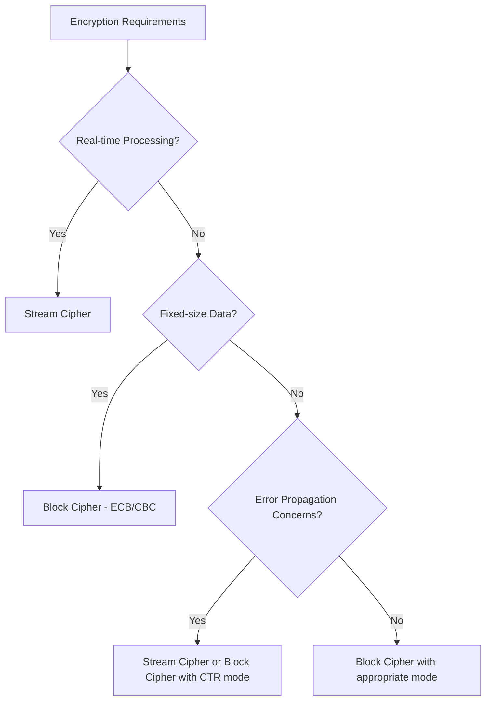

# Stream and Block Ciphers: A Comprehensive Analysis

Cryptography forms the backbone of modern digital security, with symmetric key encryption being one of its fundamental components. Two primary approaches to symmetric encryption are stream ciphers and block ciphers, each with distinct characteristics, applications, and security implications.

## Stream Ciphers

Stream ciphers are encryption algorithms that encrypt data one bit or byte at a time, creating a continuous stream of encrypted output. They operate by generating a pseudorandom keystream that is combined with the plaintext to produce ciphertext.

### Core Principles

Stream ciphers encrypt data sequentially, typically using the XOR (exclusive OR) operation to combine each bit or byte of plaintext with the corresponding bit or byte of the keystream. The mathematical representation of this process is:

$$ C_i = P_i \oplus K_i $$

Where:
- $$C_i$$ represents the ciphertext bit/byte
- $$P_i$$ represents the plaintext bit/byte
- $$K_i$$ represents the keystream bit/byte
- $$\oplus$$ represents the XOR operation

### Keystream Generation

The security of a stream cipher depends heavily on the quality of its keystream generator. A good keystream should:
- Be pseudorandom (appear random but be deterministically generated)
- Have a long period before repeating
- Be unpredictable without knowledge of the key

Most stream ciphers use an initialization vector (IV) along with the secret key to generate the keystream. The IV ensures that even when encrypting the same plaintext with the same key multiple times, different ciphertext is produced[2].



### Types of Stream Ciphers

Stream ciphers can be categorized into two main types:

1. **Synchronous Stream Ciphers**: The keystream is generated independently of the plaintext and ciphertext. Both the sender and receiver must remain synchronized for successful encryption and decryption[2][9].

2. **Self-Synchronizing/Asynchronous Stream Ciphers**: The keystream generation depends on previous ciphertext bits, allowing the system to recover from transmission errors or lost bits automatically[9].

### One-Time Pad

The one-time pad is a theoretical perfect stream cipher where the keystream is:
- Truly random (not pseudorandom)
- At least as long as the message
- Used only once

When implemented correctly, the one-time pad provides perfect secrecy, making it mathematically unbreakable[2]. However, practical limitations in generating and securely distributing truly random keys make it impractical for most applications.

### Implementation Example

Here's a simple example of stream cipher encryption using XOR:

```
Key: 101011
IV: 110100
Keystream: 011111

Plaintext: 1100101
Keystream: 0111111
Ciphertext: 1011010
```

To decrypt, the same keystream is XORed with the ciphertext to recover the plaintext[6].

### Applications

Stream ciphers are particularly well-suited for:
- Real-time communications (like video streaming or online gaming)[1]
- Environments with limited computational resources
- Scenarios where data arrives in a continuous stream
- Applications where error propagation must be minimized

## Block Ciphers

Block ciphers encrypt fixed-size blocks of data at once, typically 64 or 128 bits, using a deterministic algorithm and a symmetric key.

### Core Principles

A block cipher consists of two paired algorithms:
- An encryption function E
- A decryption function D (the inverse of E)

Mathematically, for a key K and plaintext block P, the ciphertext C is:

$$ C = E_K(P) $$

And decryption is:

$$ P = D_K(C) $$

Where $$E_K$$ represents the encryption function using key K, and $$D_K$$ represents the decryption function using the same key[3].

### Block Cipher Structure

Block ciphers typically employ a combination of substitution and permutation operations (known as SP-networks) or Feistel structures to achieve confusion and diffusion—two properties identified by Claude Shannon as necessary for secure ciphers.



### Modes of Operation

Since block ciphers can only encrypt fixed-size blocks, various modes of operation have been developed to handle messages of arbitrary length:

1. **Electronic Codebook (ECB)**: Each block is encrypted independently. This is the simplest but least secure mode as patterns in the plaintext remain visible in the ciphertext[3][7].

2. **Cipher Block Chaining (CBC)**: Each plaintext block is XORed with the previous ciphertext block before encryption, requiring an initialization vector for the first block[3][4].

3. **Cipher Feedback (CFB)**: Transforms a block cipher into a stream cipher by encrypting the previous ciphertext block and XORing the result with the plaintext[3].

4. **Output Feedback (OFB)**: Similar to CFB but encrypts the previous OFB output instead of the ciphertext, creating a keystream independent of the plaintext and ciphertext[3].

5. **Counter (CTR)**: Encrypts a counter value and XORs the result with the plaintext, effectively turning the block cipher into a stream cipher. Unlike OFB, it allows parallel encryption and decryption[3][4].





### Padding

When the plaintext length is not a multiple of the block size, padding is added to complete the final block. Common padding schemes include PKCS#7, where the value of each padding byte is equal to the number of padding bytes added[4].

### Applications

Block ciphers are commonly used for:
- Encrypting stored data (data at rest)
- Bulk encryption of files and databases
- Secure communication protocols (with appropriate modes)
- Message authentication codes and hash functions

## Comparison of Stream and Block Ciphers

| Characteristic      | Block Cipher                                                              | Stream Cipher                                       |
| ------------------- | ------------------------------------------------------------------------- | --------------------------------------------------- |
| Data Processing     | Encrypts fixed-size blocks (typically 64 or 128 bits)                     | Encrypts data bit by bit or byte by byte[1][5][7]   |
| Primary Use         | Data-at-rest encryption                                                   | Data-in-transit encryption[5]                       |
| Processing Power    | Requires high processing power                                            | Requires low processing power[5]                    |
| Computational Load  | High computational load                                                   | Low computational load[5]                           |
| Memory Requirements | Higher memory requirements                                                | Lower memory requirements[5][11]                    |
| Speed               | Generally slower but can be optimized (e.g., AES)                         | Generally faster for sequential data[1][5]          |
| Error Propagation   | Errors can propagate within a block or between blocks (depending on mode) | Errors typically affect only individual bits[9][11] |
| Padding             | Required when data length is not a multiple of block size                 | Not required[4][11]                                 |
| Parallelization     | Some modes allow parallel processing                                      | Typically sequential by nature[11]                  |
| Principles Used     | Both confusion and diffusion                                              | Primarily confusion[10]                             |
| Complexity          | Complex algorithm structure                                               | Simpler algorithm structure[7]                      |
| Common Examples     | AES, DES, 3DES, Blowfish                                                  | RC4, Salsa20, ChaCha20[7][9]                        |
| Modes of Operation  | ECB, CBC, CFB, OFB, CTR                                                   | Not applicable in the same sense[10]                |
| Versatility         | Can operate as a stream cipher (in certain modes)                         | Cannot operate as a block cipher[5]                 |

### Security Considerations

1. **Stream Ciphers**:
   - Vulnerable if the same keystream is reused (two-time pad attack)
   - Generally faster but may be more susceptible to certain cryptanalytic attacks
   - Critical to have good randomness in keystream generation

2. **Block Ciphers**:
   - ECB mode reveals patterns in the data
   - CBC and other modes can be vulnerable to padding oracle attacks
   - IV must be random and unpredictable for secure operation
   - More thoroughly analyzed and standardized

### Performance Trade-offs



## Conclusion

Both stream and block ciphers have their place in modern cryptography. Stream ciphers excel in real-time applications where data arrives continuously and processing resources are limited. Block ciphers provide robust security for stored data and are more thoroughly standardized and analyzed.

The choice between them depends on specific requirements:
- For encrypting real-time communications with minimal latency, stream ciphers are often preferred
- For encrypting stored data with high security requirements, block ciphers with appropriate modes are typically chosen
- For resource-constrained environments, stream ciphers may be more efficient
- For applications requiring parallel processing, certain block cipher modes may be advantageous

Understanding the strengths and limitations of each approach allows security architects to select the most appropriate cipher for their specific use case, balancing security, performance, and implementation constraints.

Citations:
[1] https://www.geeksforgeeks.org/stream-ciphers/
[2] https://www.techtarget.com/searchsecurity/definition/stream-cipher
[3] https://en.wikipedia.org/wiki/Block_cipher
[4] https://www.techtarget.com/searchsecurity/definition/block-cipher
[5] https://nordvpn.com/blog/block-cipher-vs-stream-cipher/
[6] https://www.tutorialspoint.com/cryptography/cryptography_stream_cipher.htm
[7] https://www.geeksforgeeks.org/difference-between-block-cipher-and-stream-cipher/
[8] https://www.thesslstore.com/blog/block-cipher-vs-stream-cipher/
[9] https://www.scaler.com/topics/block-cipher-vs-stream-cipher/
[10] https://www.tutorialspoint.com/difference-between-block-cipher-and-stream-cipher
[11] https://sslinsights.com/block-cipher-vs-stream-cipher/
[12] https://www.okta.com/identity-101/stream-cipher/
[13] https://www.sciencedirect.com/topics/computer-science/stream-cipher
[14] https://en.wikipedia.org/wiki/Stream_cipher
[15] https://www.sciencedirect.com/topics/mathematics/stream-cipher
[16] https://rickwash.com/papers/stream.pdf
[17] https://www.youtube.com/watch?v=xgteFcAg4XQ
[18] https://www.drawio.com/blog/mermaid-diagrams
[19] http://www.facweb.iitkgp.ac.in/~sourav/lecture_note2.pdf
[20] https://mermaid.js.org
[21] https://www.paris.inria.fr/secret/Anne.Canteaut/encyclopedia.pdf
[22] https://mermaid.live
[23] https://www.mermaidchart.com
[24] https://www.geeksforgeeks.org/block-cipher-modes-of-operation/
[25] https://www.sciencedirect.com/topics/computer-science/block-cipher
[26] https://jscrambler.com/blog/cryptography-introduction-block-ciphers
[27] https://www.tutorialspoint.com/cryptography/block_cipher.htm
[28] https://mermaid.js.org/syntax/sequenceDiagram.html
[29] https://www.sangfor.com/glossary/cybersecurity/what-is-block-cipher
[30] https://www.thesslstore.com/blog/block-cipher-vs-stream-cipher/
[31] https://ctf101.org/cryptography/what-are-block-ciphers/
[32] https://www.youtube.com/watch?v=m2AznaJVjdI
[33] https://www.jetbrains.com/help/writerside/mermaid-diagrams.html
[34] https://en.wikipedia.org/wiki/Block_cipher_mode_of_operation
[35] https://bluegoatcyber.com/blog/stream-vs-block-ciphers/
[36] https://mermaid.js.org/syntax/flowchart.html
[37] https://certera.com/blog/block-cipher-vs-stream-cipher/
[38] https://testbook.com/key-differences/difference-between-block-cipher-and-stream-cipher
[39] https://crypto.stackexchange.com/questions/5333/difference-between-stream-cipher-and-block-cipher
[40] https://www.baeldung.com/cs/stream-cipher-vs-block-cipher
[41] https://univagora.ro/jour/index.php/ijccc/article/download/2506/967/5179
[42] https://www.youtube.com/watch?v=WBd5pcyFeTQ
[43] https://www.innokrea.com/cryptography-stream-ciphers/
[44] https://engineering.purdue.edu/kak/compsec/NewLectures/Lecture3.pdf
[45] https://mermaid.js.org/syntax/block.html
[46] https://study.com/academy/lesson/block-cipher-definition-purpose-examples.html
[47] https://www.geeksforgeeks.org/block-cipher-design-principles/
[48] https://www.youtube.com/watch?v=3adBPqIB4Tw
[49] https://byjus.com/gate/difference-between-block-cipher-and-stream-cipher/

---
Answer from Perplexity: pplx.ai/share

# References


###### Information
- date: 2025.04.22
- time: 10:26