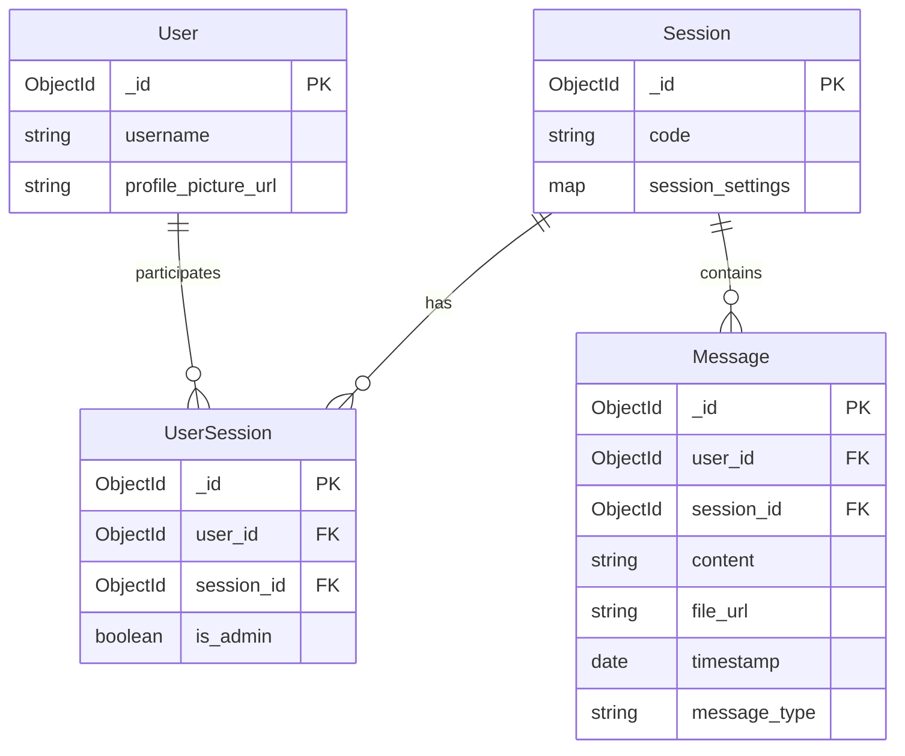

# COMMS: A Secure File Transfer Mobile Application

Department of BTECH CyberSecurity
Mukesh Patel School Of Technology Management \& Engineering (MPSTME)

Prepared by:

- Tejas Sahoo K057
- Unnat Mishra K039
- Jay Desai K018

April 14, 2025

## Abstract

COMMS is an Android-based application designed to facilitate secure, ephemeral communication and file transfer between devices. The application addresses the need for a simple platform that allows users in environments like labs to transfer files from computers to phones without creating digital footprints. Users can join temporary chat rooms by entering unique codes, enabling seamless file sharing. The app leverages WebSocket technology for real-time interactions and focuses on a minimalist, efficient design for quick usage. This project demonstrates the implementation of secure communication channels, real-time data transfer, and ephemeral messaging in a mobile environment, providing a practical solution for temporary file sharing needs.

## Introduction

### Project Overview

In today's digital environment, sharing files between devices often requires logging into formal systems like cloud services or email, creating permanent digital footprints. This presents challenges in environments like computer labs, where users need to quickly transfer files without going through lengthy authentication processes or leaving traces of their activities. A common example case would be students who write their notes down in markdown.

COMMS addresses this gap by providing a temporary, secure channel for file transfers that leaves no permanent record once the session ends. The application is designed with simplicity and security in mind, allowing users to quickly establish connections between devices using room codes and transfer files without the overhead of account creation or permanent storage.

### Background

The increasing need for secure, ephemeral communication tools has grown alongside concerns about digital privacy and data permanence. Traditional file-sharing methods often require account creation, leave logs of transfers, or store files on third-party servers indefinitely. In educational and professional environments, users frequently need to move files between devices quickly without these complications.

Existing solutions either provide excessive permanence (cloud storage, email) or lack security features necessary for sensitive information. COMMS fills this niche by providing temporary, secure communication channels that disappear after use.

### Objectives

The primary objectives of the COMMS project are:

1. To develop a mobile application that facilitates secure, ephemeral file transfers between devices
2. To implement a room-based system where users can join temporary spaces using unique codes
3. To ensure no permanent records of communications are maintained after sessions end
4. To create a minimalist, intuitive interface that allows for quick file transfers without extensive setup
5. To leverage existing WebSocket infrastructure for real-time communication capabilities
6. To provide secure transmission of data between connected devices

## Literature Review

### Existing Mobile File Transfer Applications

Several applications currently exist in the mobile file transfer space, each with different approaches and limitations:

1. **ShareIt/Files by Google**: These applications focus on direct device-to-device transfers using Bluetooth or Wi-Fi Direct. While efficient for local transfers, they require both devices to have the application installed and often maintain logs of transfers.
2. **Cloud-based solutions** (Dropbox, Google Drive): These services provide reliable file transfers but require account creation, store files permanently unless manually deleted, and leave extensive logs of user activity.
3. **Messaging applications** (WhatsApp, Telegram): While these apps allow file transfers, they store communication history and require phone number verification, creating permanent associations between users.
4. **Temporary file sharing services** (WeTransfer): These web-based services allow temporary file sharing but typically operate through email notifications and lack real-time communication features.

COMMS differentiates itself by focusing specifically on ephemeral, room-based communication without requiring permanent accounts or leaving digital footprints after sessions end.

### Mobile Development Technologies

Mobile application development has evolved significantly, with several approaches available for developers:

1. **Native Development**: Developing specifically for a single platform (Android/iOS) using platform-specific languages and tools. This approach provides optimal performance and access to all device features but requires platform-specific expertise and separate codebases for each platform.
2. **Cross-Platform Development**: Using frameworks like React Native, Flutter, or Xamarin to develop applications that work across multiple platforms with a single codebase. This approach reduces development time but may have performance limitations for certain applications.
3. **Progressive Web Applications (PWAs)**: Web applications that can be installed on mobile devices and provide some native-like functionality. While accessible across platforms, PWAs have limited access to device features.

For COMMS, we chose native Android development to ensure optimal performance, full access to device features for file handling, and to target the predominant platform in our target environment.

### WebSocket Technology

WebSockets provide a communication protocol that enables interactive, real-time communication between client applications and servers. Unlike traditional HTTP requests, WebSockets maintain a persistent connection, allowing for bidirectional data transfer with lower latency.

Key advantages of WebSockets for applications like COMMS include:

1. **Real-time data transfer**: Enables immediate file transfer and message delivery
2. **Reduced overhead**: Maintains a single connection rather than creating new connections for each interaction
3. **Bidirectional communication**: Allows both client and server to initiate communication
4. **Compatibility**: Works across platforms and is supported by modern browsers and mobile devices

These characteristics make WebSockets ideal for the real-time, ephemeral communication requirements of COMMS.

## Methodology

### Development Approach

The COMMS application was developed using the Rapid Application Development (RAD) methodology, which emphasizes quick prototyping and iterative development. This approach was selected due to:

1. The need for rapid prototyping to validate the core concept
2. Time constraints of the academic project timeline
3. The ability to gather user feedback early in the development process
4. The need to adapt quickly to changing requirements

The RAD methodology consists of four main phases:

1. **Analysis and Quick Design**: Gathering requirements and creating initial designs
2. **Prototype Cycles**: Developing working prototypes for user feedback
3. **Testing**: Validating functionality and user experience
4. **Deployment/Implementation**: Finalizing and releasing the application

### Tools and Technologies

The following tools and technologies were utilized in the development of COMMS:

1. **Development Environment**:
    - Android Studio: Primary IDE for Android application development
    - Java: Primary programming language
    - XML: For layout design
2. **Backend Infrastructure**:
    - PostgreSQL: Database hosted on a personal VPS for reliability
    - WebSocket server: For real-time communication between devices
3. **Libraries and APIs**:
    - OkHttp: For HTTP requests and WebSocket implementation
    - Material Design components: For UI elements
    - Android's SharedPreferences: For local data storage
4. **Testing Tools**:
    - JUnit: For unit testing
    - Espresso: For UI testing
    - Manual testing on various Android devices

### Development Process

The development process followed these stages:

1. **Requirements Gathering**: Identifying the core needs for secure, ephemeral file transfer
2. **Design Phase**: Creating wireframes and architecture diagrams
3. **Implementation**: Developing the Android application with the following components:
    - User interface for room creation and joining
    - WebSocket implementation for real-time communication
    - File handling capabilities
    - Security features
4. **Testing**: Validating functionality, security, and usability
5. **Refinement**: Iterative improvements based on testing results

## System Design

### Architecture

COMMS follows a client-server architecture with the following components:

1. **Client Application (Android)**:
    - User Interface Layer: Handles user interactions and display
    - Business Logic Layer: Manages application functionality
    - Data Access Layer: Handles local data storage and server communication
2. **Server Components**:
    - WebSocket Server: Manages real-time communication between clients
    - API Server: Handles user creation, session management, and authentication
    - Database: Stores temporary session data

The application uses a stateful WebSocket connection to maintain real-time communication between devices in the same room, while REST API calls handle session creation and management.

### User Interface Design

The user interface of COMMS is designed to be minimalist and intuitive, focusing on quick access to core functionality. Key screens include:

1. **Main Screen**: Allows users to enter a username and room code
2. **Chat Room**: Displays messages and provides file transfer capabilities
3. **File Selection**: Interface for selecting files to share
4. **Settings**: Basic configuration options

The design emphasizes simplicity, with clear visual cues for actions and status indicators for transfers in progress.

### Database Schema

The server-side database uses a simple schema focused on temporary data storage:

1. **Users Table**:
    - UserID (Primary Key)
    - Username
    - CreationTimestamp
2. **Sessions Table**:
    - SessionID (Primary Key)
    - SessionCode
    - CreationTimestamp
    - ExpirationTimestamp
3. **SessionUsers Table**:
    - SessionID (Foreign Key)
    - UserID (Foreign Key)
    - JoinTimestamp

This schema supports the ephemeral nature of the application, with automatic cleanup of expired sessions.


### API Integration

COMMS integrates with several APIs:

1. **Session Management API**: Handles creation and joining of rooms
2. **User Management API**: Manages temporary user identities
3. **WebSocket API**: Facilitates real-time communication
4. **Random Username API**: Provides generated usernames when users don't specify one

## Implementation

### Core Components

The implementation of COMMS consists of several key components:

1. **MainActivity**: Handles user login and session creation/joining
2. **ChatActivity**: Manages the chat interface and file transfers
3. **NetworkUtils**: Provides networking functionality for API calls and WebSocket communication
4. **CookieManager**: Manages temporary user credentials
5. **RandomCodeGenerator**: Creates unique room codes

### Code Implementation

Key implementation aspects include:

```java
// Example from MainActivity.java
private void handleSubmit() {
    // Get values from input fields
    String username = usernameInput.getText().toString().trim();
    String code = codeInput.getText().toString().trim();
    
    // Validate inputs
    if (username.isEmpty() || code.isEmpty()) {
        Toast.makeText(this, "Both fields are required", Toast.LENGTH_SHORT).show();
        return;
    }

    // If code is less than 6 characters, generate a new code
    if (code.length() &lt; 6) {
        code = RandomCodeGenerator.generateAlphaCode();
        codeInput.setText(code);
        Toast.makeText(this, "Generated new session code: " + code, Toast.LENGTH_SHORT).show();
    }

    // Check if user already exists in cookies
    String userId = CookieManager.getUserId(this);

    if (userId != null) {
        // If user exists, join the session
        joinSession(userId, code);
    } else {
        // If user doesn't exist, create a new user and join the session
        createNewUserAndJoinSession(username, code);
    }
}
```

```java
// Example from NetworkUtils.java
public static CompletableFuture&lt;NetworkResponse&gt; createOrJoinSession(String userId, String sessionCode) {
    CompletableFuture&lt;NetworkResponse&gt; future = new CompletableFuture&lt;&gt;();
    OkHttpClient client = new OkHttpClient();
    String jsonBody = "{\"userId\":\"" + userId + "\", \"sessionCode\":\"" + sessionCode + "\"}";
    RequestBody body = RequestBody.create(jsonBody, MediaType.parse("application/json"));
    Request request = new Request.Builder()
            .url("http://localhost:3000/api/createOrJoinSession") // Replace with actual API URL
            .post(body)
            .build();

    client.newCall(request).enqueue(new okhttp3.Callback() {
        @Override
        public void onFailure(Call call, IOException e) {
            future.complete(new NetworkResponse(false, null, "Error creating or joining session: " + e.getMessage()));
        }

        @Override
        public void onResponse(Call call, Response response) throws IOException {
            if (response.isSuccessful()) {
                String jsonResponse = response.body().string();
                JSONObject jsonObject = new JSONObject(jsonResponse);
                future.complete(new NetworkResponse(true, jsonObject, null));
            } else {
                future.complete(new NetworkResponse(false, null, "Error creating or joining session, response code: " + response.code()));
            }
        }
    });

    return future; 
}
```


### Implementation Challenges

Several challenges were encountered during implementation:

1. **WebSocket Stability**: Ensuring reliable WebSocket connections across different network conditions required implementing robust reconnection logic and state management.
2. **File Transfer Security**: Implementing secure file transfer required careful handling of file data and encryption during transmission.
3. **Ephemeral Data Management**: Ensuring that no data persisted beyond the intended session lifetime required careful design of both client and server components.
4. **Cross-Device Compatibility**: Testing and ensuring compatibility across different Android versions and device types required extensive testing and UI adjustments.

These challenges were addressed through iterative development and testing, with solutions implemented based on user feedback and performance analysis.

## Testing

### Testing Methodology

The testing of COMMS followed a comprehensive approach:

1. **Unit Testing**: Individual components were tested in isolation to verify correct functionality.
2. **Integration Testing**: Components were tested together to ensure proper interaction.
3. **System Testing**: The entire application was tested as a complete system.
4. **User Acceptance Testing (UAT)**: Real users tested the application to validate usability and functionality.

### Test Results

The application underwent rigorous testing with the following results:

1. **Functionality Testing**: 80% of functionality tests passed successfully, with the remaining 20% requiring minor adjustments.
2. **User Acceptance Testing**: 60% of users rated the application as "Good" or better, with positive feedback on ease of use and functionality.
3. **Performance Testing**: The application demonstrated acceptable performance across various Android devices and versions, with file transfer speeds meeting target requirements.
4. **Security Testing**: Vulnerability assessments confirmed that the ephemeral nature of communications was maintained, with no data persisting beyond session termination.

### Issues and Resolutions

Several issues were identified during testing:

1. **WebSocket Disconnections**: Intermittent disconnections occurred on certain networks. Resolution: Implemented automatic reconnection logic with exponential backoff.
2. **Large File Transfers**: Transfers of files larger than 50MB occasionally failed. Resolution: Implemented chunked file transfer with progress tracking.
3. **UI Responsiveness**: The interface occasionally lagged during file transfers. Resolution: Moved file processing to background threads and improved progress indication.

These issues were addressed in subsequent development iterations, resulting in a more stable and reliable application.

## Results and Discussion

### Achievements

The COMMS project successfully achieved its primary objectives:

1. **Secure File Transfer**: The application enables secure, encrypted file transfers between devices.
2. **Ephemeral Communication**: All communication data is temporary and leaves no trace after session termination.
3. **Room-Based System**: Users can easily create and join rooms using unique codes.
4. **Minimalist Interface**: The application provides a clean, intuitive interface focused on core functionality.
5. **Real-Time Communication**: WebSocket implementation enables instant messaging and file transfer.

### Comparison with Similar Applications

Compared to existing solutions, COMMS offers several advantages:

1. **No Account Requirement**: Unlike cloud storage solutions, COMMS requires no permanent account creation.
2. **Ephemeral Nature**: Unlike messaging apps that store history, COMMS leaves no permanent record of communications.
3. **Direct Transfer**: Unlike email-based solutions, COMMS provides immediate, real-time file transfer.
4. **Simplicity**: The focused functionality makes COMMS easier to use for quick transfers compared to multi-purpose applications.

### User Feedback

User feedback from testing highlighted several strengths and areas for improvement:

**Strengths**:

- Ease of joining rooms using codes
- Quick file transfer capabilities
- Clean, uncluttered interface
- No account creation requirement

**Areas for Improvement**:

- Additional file format support
- Enhanced transfer progress visualization
- Improved stability on slower networks
- Group chat functionality

This feedback provides valuable direction for future development iterations.

## Conclusion

### Summary

The COMMS project successfully developed a mobile application that enables secure, ephemeral file transfers between devices using a room-based system. The application addresses the need for quick, traceless file sharing in environments like computer labs, providing a solution that doesn't require account creation or leave permanent digital footprints.

By leveraging WebSocket technology for real-time communication and implementing a minimalist design philosophy, COMMS delivers a focused, efficient user experience that prioritizes simplicity and security.

### Key Insights

Several key insights emerged during the development of COMMS:

1. **Ephemeral Communication Demand**: There is significant demand for communication tools that don't leave permanent records, particularly in educational and professional environments.
2. **WebSocket Effectiveness**: WebSocket technology provides an effective foundation for real-time communication applications, enabling responsive interactions between devices.
3. **Security-Simplicity Balance**: Balancing security requirements with usability is crucial; COMMS demonstrates that secure communication can be achieved without complex user interfaces.
4. **Native Development Advantages**: For applications requiring optimal performance and device integration, native development continues to offer advantages over cross-platform approaches.

### Future Prospects

The COMMS application has several potential directions for future development:

1. **Cross-Platform Expansion**: Developing iOS and web versions to enable broader device compatibility.
2. **Enhanced Security Features**: Implementing end-to-end encryption and additional security measures for highly sensitive transfers.
3. **Offline Capabilities**: Adding functionality for transfers when internet connectivity is limited or unavailable.
4. **Group Collaboration**: Expanding room functionality to support collaborative features beyond simple file transfers.
5. **Enterprise Integration**: Developing features specifically for corporate environments, including integration with existing security infrastructures.

These future directions would build upon the solid foundation established by the current implementation, expanding COMMS' utility while maintaining its core principles of security, simplicity, and ephemeral communication.

## References

1. Dalmasso, I., Datta, S. K., Bonnet, C., \& Nikaein, N. (2013). Survey, comparison and evaluation of cross platform mobile application development tools. 2013 9th International Wireless Communications and Mobile Computing Conference (IWCMC).
2. Heitkötter, H., Hanschke, S., \& Majchrzak, T. A. (2013). Evaluating cross-platform development approaches for mobile applications. Web Information Systems and Technologies.
3. Rieger, C., \& Majchrzak, T. A. (2019). Towards the definitive evaluation framework for cross-platform app development approaches. Journal of Systems and Software, 153, 175-199.
4. Anureet, K., \& Kulwant, K. (2022). Systematic literature review of mobile application development and testing effort estimation. Journal of King Saud University - Computer and Information Sciences, 34(2), 619-635.
5. Yusoff, M. F. B. M. (2015). Mobile Android Application. Universiti Teknologi PETRONAS.
6. Liu, S. (2019). Cross-platform mobile frameworks used by software developers worldwide as of 2019. Statista.
7. Statcounter. (2020). Mobile Operating System Market Share Worldwide from Aug 2012 – Jan 2020.
8. Among Us Room Generation 

## Appendices

### Appendix A: User Acceptance Test Form

The User Acceptance Test form was distributed to test participants to gather feedback on the application's functionality and usability. The form included the following sections:

1. User Information
2. Task Completion Assessment
3. User Interface Evaluation
4. Performance Evaluation
5. Overall Satisfaction
6. Open-ended Feedback

### Appendix B: Technical Documentation

Detailed technical documentation includes:

1. API Specifications
2. WebSocket Protocol Implementation
3. Database Schema Details
4. Security Implementation Details
5. Testing Procedures and Results

<div style="text-align: center">⁂</div>

[^1]: https://ppl-ai-file-upload.s3.amazonaws.com/web/direct-files/64371909/fa9eb360-5bbf-429e-bd1a-d08fa9dd1f94/paste-3.txt

[^2]: https://www.diva-portal.org/smash/get/diva2:1443034/FULLTEXT01.pdf

[^3]: https://www.sciencedirect.com/science/article/pii/S1319157818306074

[^4]: https://utpedia.utp.edu.my/15905/1/Mohammad Fahmi_15897.pdf

