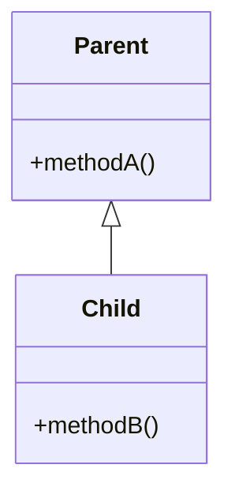
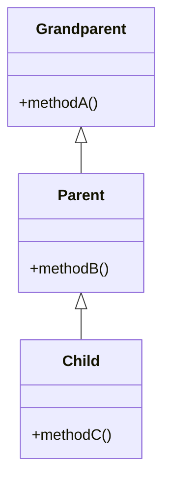
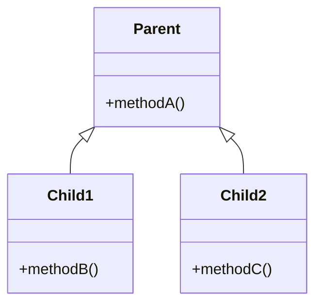
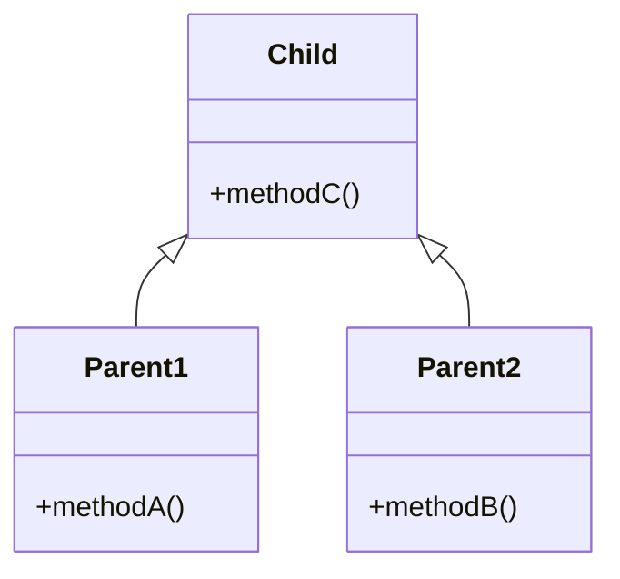
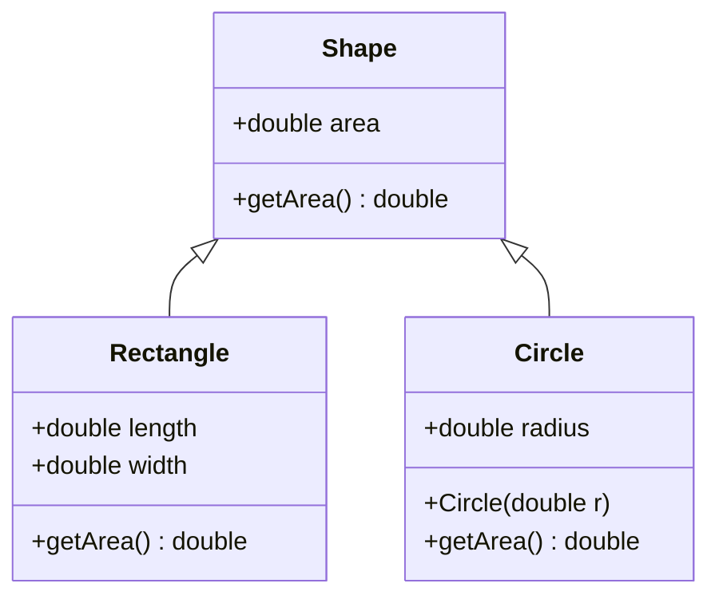
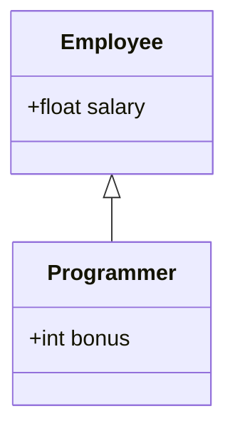

In this note we mainly focus on JAVA but many of these concepts can be applied to other programming languages as well
# Inheritance
Inheritance is the representation of arbitrary **IS-A Relationship**s which is also known as a parent-relationship.
Inheritance is what enables a new ( **Child** Class ) mechanism/class/object  to acquire the properties and behaviour of another object ( **Parent** Class).
### Key Concepts
- **Child Class**/**Sub Class**: Also known as derived extended or child class
- **Parent Class**/**Super Class**: Also known as the based class
### Purpose of Inheritance
1. **Code Reusability**: Inheritance allows the reuse of the parent class code in the child class, reducing redundancy and enabling the extension of functionalities without modifying the existing code.
2. **Extensibility**: New features and behavior can be added to the child class without affecting the parent class. This means the base code can remain intact while the child class can implement or override new functionality.
3. **Maintainability**: Since common code is centralized in the parent class, changes only need to be made in one place, making it easier to maintain and update code across different child classes.
4. **Method Overriding**: The child class can change the behavior of methods inherited from the parent class. This is useful when the child class needs to modify or extend the functionality defined in the parent class.

## Advantages and Disadvantages
- Code reusability is 
---
# Types of Inheritance
There are various types of inheritance we can implement. These types arise due to ?

### Single Inheritance
When there is a single parent the inheritance is called single Inheritance.

---
## Multilevel Inheritance
When the class is derived from a class that is already a child class of some other parent class this entire inheritance can be called as multilevel inheritance.

---
### Hierarchical Inheritance
When a class is parent to two other classes the relationship can be called as Hierarchical Inheritance

---
### Multiple Inheritance
When a child class inherits the properties of two or more different parent classes it is called as multiple Inheritance. The java programming language does not support multiple inheritance. But it can still be achieved using [[Interfaces]].

---
### Hybrid Inheritance


---
## UML of a Inheritance
In this example the shape class is a parent which exhibits Hierarchical Inheritance as the `Rectangle` and the `Circle` inherits the properties of the shape.


# Example of Inheritance
Employee Programmer
```java
class Employee{
	float salary=4000;
}
class Programmer extends Employee{
	int bonus=10000;
	public static void main(String args[]){
		Programmer P = new Programmer();
		System.out.println("The salary of the programmer is: "+p.salary);
		System.out.println("The bonus of the programmer is: "+p.bonus);
	}
}
```

```bash
Programmers Salary is : 4000
Programmers Bonus is : 10000
```

The mermaid diagram is as follows:


# References


###### Information
- date: 2025.02.27
- time: 10:14