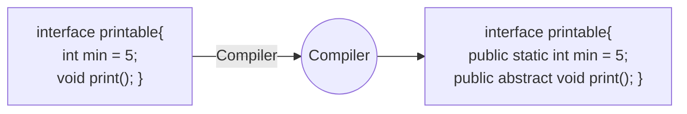

# Interfaces
This is another method to achieve abstraction in java. They specify what a class must do and not how. It is the blueprint of the class with no methods defined.
It is a collection of abstract methods and its Used when various implementations share only method signature. It does not have any constructors.

- Total Abstraction
- Achieve multiple inheritance in Java
- Cannot Contain Constructor
- `Implements` keyword
- It is used for loosely coupling
#### Definition : Coupling
Coupling is a measure of how much a class is dependent on another class. The more a class is dependent on another class, the more tightly coupled they are. Interfaces help in reducing the coupling between classes.


| Feature                 | [[Abstraction\|Abstract Class]]                              | [[Interfaces]]                                                                                     |
| ----------------------- | ------------------------------------------------------------ | -------------------------------------------------------------------------------------------------- |
| **Method Types**        | Can have both **abstract** and **concrete** methods          | Only contains **abstract methods** (until Java 8, which introduced `default` and `static` methods) |
| **Access Modifiers**    | Methods can be `private`, `protected`, or `public`           | All methods are **public** by default                                                              |
| **Fields (Attributes)** | Can have **instance variables**                              | All fields are **public, static, and final** (constants)                                           |
| **Constructors**        | Can have constructors                                        | Cannot have constructors                                                                           |
| **Inheritance**         | Supports **single inheritance** (`extends` one class)        | Supports **multiple inheritance** (`implements` multiple interfaces)                               |
| **Use Case**            | Used for **shared behavior** among related classes           | Used for defining a **contract** for unrelated classes                                             |
| **Performance**         | Slightly faster (because it supports partial implementation) | May have a slight overhead due to dynamic method resolution                                        |
|                         |                                                              |                                                                                                    |

### Properties
- An Interface is declared by using interface keyword
- Interface methods are by default abstract and public
- Interface attributes are by default public, static and final

### Example of inheritance
```java
// Define the Polygon interface
interface Polygon {
    // Abstract method (implicitly public and abstract)
    void getArea();
}

// Rectangle class implements Polygon interface
class Rectangle implements Polygon {
    private int length, width;

    // Constructor
    public Rectangle(int length, int width) {
        this.length = length;
        this.width = width;
    }

    // Implementing the getArea() method from the interface
    @Override
    public void getArea() {
        int area = length * width;
        System.out.println("Rectangle Area: " + area);
    }

    public static void main(String[] args) {
        // Creating an instance of Rectangle
        Rectangle rect = new Rectangle(10, 5);
        rect.getArea(); // Output: Rectangle Area: 50
    }
}
```

## Achieving Multiple inheritance
Here's a **Java program** demonstrating **multiple interface inheritance**, where a class implements two interfaces:
```java
// First interface
interface FirstInterface {
    void firstMethod(); // Abstract method
}

// Second interface
interface SecondInterface {
    void secondMethod(); // Abstract method
}

// Class implementing both interfaces
class DemoClass implements FirstInterface, SecondInterface {
    
    // Implementing firstMethod() from FirstInterface
    @Override
    public void firstMethod() {
        System.out.println("First method from FirstInterface.");
    }

    // Implementing secondMethod() from SecondInterface
    @Override
    public void secondMethod() {
        System.out.println("Second method from SecondInterface.");
    }

    public static void main(String[] args) {
        // Creating an instance of DemoClass
        DemoClass obj = new DemoClass();
        
        // Calling methods
        obj.firstMethod();
        obj.secondMethod();
    }
}
```

### **Explanation**:

1. **FirstInterface** → Declares `firstMethod()`.
2. **SecondInterface** → Declares `secondMethod()`.
3. **DemoClass** → Implements both interfaces and provides method definitions.
4. **Main Method** → Creates an instance of `DemoClass` and calls both methods.

## Default Methods
Here's a Java program implementing the **Polygon interface** with a **default method**, demonstrating how the default implementation is used when a class doesn't override it.

```java
// Polygon interface
interface Polygon {
    // Abstract method to calculate area
    void getArea();

    // Abstract method to get sides
    default void getSides() {
        System.out.println("I can get sides of a polygon.");
    }
}

// Rectangle class implementing Polygon
class Rectangle implements Polygon {
    private int length, width;

    // Constructor
    public Rectangle(int length, int width) {
        this.length = length;
        this.width = width;
    }

    // Implementing getArea() method
    @Override
    public void getArea() {
        int area = length * width;
        System.out.println("Rectangle Area: " + area);
    }

    // Overriding getSides() method
    @Override
    public void getSides() {
        System.out.println("Rectangle has 4 sides.");
    }
}

// Square class implementing Polygon
class Square implements Polygon {
    private int side;

    // Constructor
    public Square(int side) {
        this.side = side;
    }

    // Implementing getArea() method
    @Override
    public void getArea() {
        int area = side * side;
        System.out.println("Square Area: " + area);
    }
    
    // Square does NOT override getSides(), so it uses the default method
}

public class Main {
    public static void main(String[] args) {
        // Creating a Rectangle object
        Rectangle rect = new Rectangle(10, 5);
        rect.getArea();   // Calls Rectangle's getArea()
        rect.getSides();  // Calls Rectangle's overridden getSides()

        // Creating a Square object
        Square sq = new Square(4);
        sq.getArea();   // Calls Square's getArea()
        sq.getSides();  // Calls Polygon's default getSides()
    }
}
```

### **Explanation**:

1. **`Polygon` Interface**:
    - Declares `getArea()`.
    - Defines `getSides()` as a **default method**, which prints `"I can get sides of a polygon."`
2. **`Rectangle` Class**:
    - Implements `getArea()`.
    - Overrides `getSides()` to print `"Rectangle has 4 sides."`
3. **`Square` Class**:
    - Implements `getArea()`.
    - **Does not override** `getSides()`, so it uses the **default implementation** from `Polygon`.
4. **Main Class**:
    - Creates instances of `Rectangle` and `Square` and calls their methods.

### **Output**:

```
Rectangle Area: 50
Rectangle has 4 sides.
Square Area: 16
I can get sides of a polygon.
```

## Another Example of Default 

Here's a **Java program** using the **Vehicle interface**, where a **Car class** implements it without overriding the alarm methods, so it defaults back to the interface's implementation.
```java
// Vehicle interface
interface Vehicle {
    // Abstract methods
    String getBrand();
    void speedUp();
    void slowDown();

    // Default methods
    default String turnAlarmOn() {
        return "Turning vehicle alarm ON.";
    }

    default String turnAlarmOff() {
        return "Turning vehicle alarm OFF.";
    }
}

// Car class implementing Vehicle
class Car implements Vehicle {
    private String brand;
    private int speed;

    // Constructor
    public Car(String brand) {
        this.brand = brand;
        this.speed = 0; // Initial speed
    }

    // Implementing getBrand() method
    @Override
    public String getBrand() {
        return brand;
    }

    // Implementing speedUp() method
    @Override
    public void speedUp() {
        speed += 10;
        System.out.println(brand + " speeding up. Current speed: " + speed + " km/h");
    }

    // Implementing slowDown() method
    @Override
    public void slowDown() {
        speed -= 5;
        if (speed < 0) speed = 0;
        System.out.println(brand + " slowing down. Current speed: " + speed + " km/h");
    }
}

public class Main {
    public static void main(String[] args) {
        // Creating a Car object
        Car myCar = new Car("Toyota");

        // Calling implemented methods
        System.out.println("Brand: " + myCar.getBrand());
        myCar.speedUp();
        myCar.slowDown();

        // Calling default methods (not overridden)
        System.out.println(myCar.turnAlarmOn());
        System.out.println(myCar.turnAlarmOff());
    }
}
```

### **Explanation**:

1. **`Vehicle` Interface**:
    - Declares `getBrand()`, `speedUp()`, and `slowDown()` as **abstract methods**.
    - Provides **default implementations** for `turnAlarmOn()` and `turnAlarmOff()`.
2. **`Car` Class**:
    - Implements `getBrand()`, `speedUp()`, and `slowDown()`.
    - **Does not override** `turnAlarmOn()` and `turnAlarmOff()`, so it uses the **default methods** from `Vehicle`.
3. **`Main` Class**:
    - Creates a `Car` object.
    - Calls implemented methods and the default alarm methods.

### **Output**:

```
Brand: Toyota
Toyota speeding up. Current speed: 10 km/h
Toyota slowing down. Current speed: 5 km/h
Turning vehicle alarm ON.
Turning vehicle alarm OFF.
```

When u want to form a cotnact between class and the outside

# References


###### Information
- date: 2025.03.13
- time: 10:19