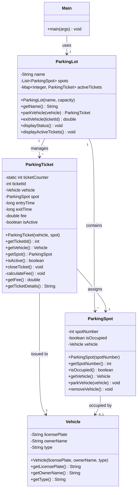

# Mall Parking System

## Problem Statement

The Mall Parking System is designed to manage parking operations for a shopping mall. It needs to track vehicles entering and exiting the parking lot, assign parking spots, generate tickets, calculate parking fees, and maintain the overall status of the parking facility. The system should handle different types of vehicles, maintain records of parking durations, and calculate appropriate fees based on the time spent in the parking lot.

## File Structure

```
src/
├── Vehicle.java         // Represents vehicles entering the parking lot
├── ParkingSpot.java     // Represents individual parking spaces
├── ParkingTicket.java   // Manages tickets issued to vehicles
├── ParkingLot.java      // Controls the overall parking facility
└── Main.java            // Driver class to run the application
```
```

```

## UML Diagram




## Program Output

```bash
========== MALL PARKING SYSTEM ==========
Current Date &amp; Time: April 17, 2025, 1:36 PM IST
=======================================
Initializing parking lot system...
✓ Successfully created parking lot with 10 available spots
---------------------------------------
Registering vehicles in the system:
✓ Registered car with license plate: MH 01 AB 5432 (Owner: Tejas)
✓ Registered bike with license plate: MH 01 CZ 7890 (Owner: Nishi &amp; Anusha)
---------------------------------------
INITIAL PARKING STATUS:
Parking Lot: Mall Parking
Total spots: 10
Occupied spots: 0
Available spots: 10
---------------------------------------
PARKING OPERATION STARTED:
Attempting to park vehicle MH 01 AB 5432 (Tejas)...
Vehicle MH 01 AB 5432 parked in spot 1
✓ Successfully parked! Ticket #1001 issued.
Attempting to park vehicle MH 01 CZ 7890 (Nishi &amp; Anusha)...
Vehicle MH 01 CZ 7890 parked in spot 2
✓ Successfully parked! Ticket #1002 issued.
---------------------------------------
UPDATED PARKING STATUS AFTER PARKING:
Parking Lot: Mall Parking
Total spots: 10
Occupied spots: 2
Available spots: 8
---------------------------------------
CURRENTLY ACTIVE PARKING TICKETS:
Active Tickets:
Ticket ID: 1001
Vehicle: MH 01 AB 5432
Spot: 1
Status: Active
--------------------
Ticket ID: 1002
Vehicle: MH 01 CZ 7890
Spot: 2
Status: Active
--------------------
---------------------------------------
SIMULATION: Time passing...
Vehicles are parked. Waiting for 2 seconds to simulate time passing...
✓ 2 seconds have passed (simulating parking duration)
---------------------------------------
VEHICLE EXIT OPERATION:
Processing exit for vehicle with ticket #1001 (Tejas)...
Vehicle MH 01 AB 5432 removed from spot 1
✓ Vehicle successfully exited from parking spot
✓ Parking fee calculated: $15.00
✓ Payment received. Thank you for using our parking service!
---------------------------------------
FINAL PARKING STATUS:
Parking Lot: Mall Parking
Total spots: 10
Occupied spots: 1
Available spots: 9
=======================================
MALL PARKING SYSTEM - SESSION SUMMARY:
• Total vehicles entered: 2
• Total vehicles exited: 1
• Total revenue collected: $15.00
=======================================

Process finished with exit code 0
```


## Relationships Between Classes

1. **Vehicle and ParkingSpot**:
    - A ParkingSpot can be occupied by at most one Vehicle (0..1 relationship)
    - A Vehicle can be assigned to exactly one ParkingSpot when parked
2. **ParkingLot and ParkingSpot**:
    - A ParkingLot contains multiple ParkingSpots (1-to-many relationship)
    - Each ParkingSpot belongs to exactly one ParkingLot
3. **ParkingLot and ParkingTicket**:
    - A ParkingLot manages multiple ParkingTickets through the activeTickets map
    - Each ParkingTicket is associated with exactly one ParkingLot
4. **ParkingTicket and Vehicle**:
    - A ParkingTicket is issued to exactly one Vehicle
    - A Vehicle can have multiple ParkingTickets over time (but only one active ticket at a time)
5. **ParkingTicket and ParkingSpot**:
    - A ParkingTicket is associated with exactly one ParkingSpot
    - A ParkingSpot can be associated with multiple ParkingTickets over time (but only one active ticket at a time)

## Dependencies

1. **Main depends on**:
    - ParkingLot
    - Vehicle
    - ParkingTicket (indirectly)
2. **ParkingLot depends on**:
    - ParkingSpot
    - ParkingTicket
    - Vehicle (indirectly)
3. **ParkingTicket depends on**:
    - Vehicle
    - ParkingSpot
4. **ParkingSpot depends on**:
    - Vehicle

## Code Implementation

### Vehicle.java

```java
public class Vehicle {
    private String licensePlate;
    private String ownerName;
    private String type; // "Car" or "Bike"

    public Vehicle(String licensePlate, String ownerName, String type) {
        this.licensePlate = licensePlate;
        this.ownerName = ownerName;
        this.type = type;
    }

    public String getLicensePlate() {
        return licensePlate;
    }

    public String getOwnerName() {
        return ownerName;
    }
    
    public String getType() {
        return type;
    }
}
```


### ParkingSpot.java

```java
public class ParkingSpot {
    private int spotNumber;
    private boolean isOccupied;
    private Vehicle vehicle;

    public ParkingSpot(int spotNumber) {
        this.spotNumber = spotNumber;
        this.isOccupied = false;
    }

    public int getSpotNumber() {
        return spotNumber;
    }

    public boolean isOccupied() {
        return isOccupied;
    }

    public Vehicle getVehicle() {
        return vehicle;
    }

    public void parkVehicle(Vehicle vehicle) {
        if (!isOccupied) {
            this.vehicle = vehicle;
            this.isOccupied = true;
            System.out.println("Vehicle " + vehicle.getLicensePlate() + " parked in spot " + spotNumber);
        } else {
            System.out.println("Spot " + spotNumber + " is already occupied");
        }
    }

    public void removeVehicle() {
        if (isOccupied) {
            System.out.println("Vehicle " + vehicle.getLicensePlate() + " removed from spot " + spotNumber);
            this.vehicle = null;
            this.isOccupied = false;
        } else {
            System.out.println("Spot " + spotNumber + " is already empty");
        }
    }
}
```


### ParkingTicket.java

```java
public class ParkingTicket {
    private static int ticketCounter = 1000;
    private int ticketId;
    private Vehicle vehicle;
    private ParkingSpot spot;
    private long entryTime;
    private long exitTime;
    private double fee;
    private boolean isActive;

    public ParkingTicket(Vehicle vehicle, ParkingSpot spot) {
        this.ticketId = ++ticketCounter;
        this.vehicle = vehicle;
        this.spot = spot;
        this.entryTime = System.currentTimeMillis();
        this.isActive = true;
    }

    public int getTicketId() {
        return ticketId;
    }

    public Vehicle getVehicle() {
        return vehicle;
    }

    public ParkingSpot getSpot() {
        return spot;
    }

    public boolean isActive() {
        return isActive;
    }

    public void closeTicket() {
        if (isActive) {
            this.exitTime = System.currentTimeMillis();
            this.isActive = false;
            calculateFee();
            spot.removeVehicle();
        }
    }

    private void calculateFee() {
        // Simple fee calculation: $10 base + $5 per hour
        long durationMillis = exitTime - entryTime;
        double hours = durationMillis / (1000.0 * 60 * 60);
        this.fee = 10 + (5 * Math.ceil(hours));
    }

    public double getFee() {
        return fee;
    }

    public String getTicketDetails() {
        return "Ticket ID: " + ticketId +
               "\nVehicle: " + vehicle.getLicensePlate() +
               "\nSpot: " + spot.getSpotNumber() +
               "\nStatus: " + (isActive ? "Active" : "Closed") +
               (isActive ? "" : "\nFee: $" + fee);
    }
}
```


### ParkingLot.java

```java
import java.util.ArrayList;
import java.util.HashMap;
import java.util.List;
import java.util.Map;

public class ParkingLot {
    private String name;
    private List&lt;ParkingSpot&gt; spots;
    private Map&lt;Integer, ParkingTicket&gt; activeTickets;

    public ParkingLot(String name, int capacity) {
        this.name = name;
        this.spots = new ArrayList&lt;&gt;();
        this.activeTickets = new HashMap&lt;&gt;();
        
        // Initialize parking spots
        for (int i = 1; i &lt;= capacity; i++) {
            spots.add(new ParkingSpot(i));
        }
    }

    public String getName() {
        return name;
    }

    public ParkingTicket parkVehicle(Vehicle vehicle) {
        // Find an available spot
        for (ParkingSpot spot : spots) {
            if (!spot.isOccupied()) {
                spot.parkVehicle(vehicle);
                ParkingTicket ticket = new ParkingTicket(vehicle, spot);
                activeTickets.put(ticket.getTicketId(), ticket);
                return ticket;
            }
        }
        System.out.println("Sorry, parking lot is full");
        return null;
    }

    public double exitVehicle(int ticketId) {
        if (activeTickets.containsKey(ticketId)) {
            ParkingTicket ticket = activeTickets.get(ticketId);
            ticket.closeTicket();
            activeTickets.remove(ticketId);
            return ticket.getFee();
        } else {
            System.out.println("Invalid ticket ID");
            return 0;
        }
    }

    public void displayStatus() {
        int total = spots.size();
        int occupied = 0;
        
        for (ParkingSpot spot : spots) {
            if (spot.isOccupied()) {
                occupied++;
            }
        }
        
        System.out.println("Parking Lot: " + name);
        System.out.println("Total spots: " + total);
        System.out.println("Occupied spots: " + occupied);
        System.out.println("Available spots: " + (total - occupied));
    }

    public void displayActiveTickets() {
        System.out.println("Active Tickets:");
        for (ParkingTicket ticket : activeTickets.values()) {
            System.out.println(ticket.getTicketDetails());
            System.out.println("--------------------");
        }
    }
}
```


### Main.java

```java
import java.time.LocalDateTime;  
import java.time.format.DateTimeFormatter;  
  
public class Main {  
    public static void main(String[] args) {  
        double revenue = 0;  
        // Create a parking lot  
        System.out.println("========== MALL PARKING SYSTEM ==========");  
        System.out.println("Current Date & Time: " +  
                LocalDateTime.now().format(DateTimeFormatter.ofPattern("EEEE, MMMM d, yyyy, h:mm a 'IST'")));  
        System.out.println("=======================================");  
  
        // Create a parking lot  
        System.out.println("Initializing parking lot system...");  
        ParkingLot mallParking = new ParkingLot("Mall Parking", ParkingConfig.DEFAULT_PARKING_CAPACITY);  
        System.out.println("✓ Successfully created parking lot with " +  
                ParkingConfig.DEFAULT_PARKING_CAPACITY + " available spots");  
        System.out.println("---------------------------------------");  
  
        // Create vehicles with Maharashtra license plates and new owner names  
        System.out.println("Registering vehicles in the system:");  
        Vehicle car1 = new Vehicle("MH 01 AB 5432", "Tejas", "Car");  
        System.out.println("✓ Registered car with license plate: MH 01 AB 5432 (Owner: Tejas)");  
  
        Vehicle bike1 = new Vehicle("MH 01 CZ 7890", "Nishi & Anusha", "Bike");  
        System.out.println("✓ Registered bike with license plate: MH 01 CZ 7890 (Owner: Nishi & Anusha)");  
        System.out.println("---------------------------------------");  
  
        // Display initial status  
        System.out.println("INITIAL PARKING STATUS:");  
        mallParking.displayStatus();  
        System.out.println("---------------------------------------");  
  
        // Park vehicles  
        System.out.println("PARKING OPERATION STARTED:");  
        System.out.println("Attempting to park vehicle MH 01 AB 5432 (Tejas)...");  
        ParkingTicket ticket1 = mallParking.parkVehicle(car1);  
        if (ticket1 != null) {  
            System.out.println("✓ Successfully parked! Ticket #" + ticket1.getTicketId() + " issued.");  
        }  
  
        System.out.println("Attempting to park vehicle MH 01 CZ 7890 (Nishi & Anusha)...");  
        ParkingTicket ticket2 = mallParking.parkVehicle(bike1);  
        if (ticket2 != null) {  
            System.out.println("✓ Successfully parked! Ticket #" + ticket2.getTicketId() + " issued.");  
        }  
        System.out.println("---------------------------------------");  
  
        // Display status after parking  
        System.out.println("UPDATED PARKING STATUS AFTER PARKING:");  
        mallParking.displayStatus();  
        System.out.println("---------------------------------------");  
  
        // Display active tickets  
        System.out.println("CURRENTLY ACTIVE PARKING TICKETS:");  
        mallParking.displayActiveTickets();  
        System.out.println("---------------------------------------");  
  
        // Simulate time passing (just for demonstration)  
        try {  
            System.out.println("SIMULATION: Time passing...");  
            System.out.println("Vehicles are parked. Waiting for 2 seconds to simulate time passing...");  
            Thread.sleep(2000);  
            System.out.println("✓ 2 seconds have passed (simulating parking duration)");  
        } catch (InterruptedException e) {  
            System.out.println("❌ Error in time simulation: " + e.getMessage());  
            e.printStackTrace();  
        }  
        System.out.println("---------------------------------------");  
  
        // Exit one vehicle  
        System.out.println("VEHICLE EXIT OPERATION:");  
        System.out.println("Processing exit for vehicle with ticket #" + ticket1.getTicketId() + " (Tejas)...");  
        double fee = mallParking.exitVehicle(ticket1.getTicketId());  
        revenue += fee;  
        System.out.println("✓ Vehicle successfully exited from parking spot");  
        System.out.println("✓ Parking fee calculated: $" + String.format("%.2f", fee));  
        System.out.println("✓ Payment received. Thank you for using our parking service!");  
        System.out.println("---------------------------------------");  
  
        // Display final status  
        System.out.println("FINAL PARKING STATUS:");  
        mallParking.displayStatus();  
        System.out.println("=======================================");  
        System.out.println("MALL PARKING SYSTEM - SESSION SUMMARY:");  
        System.out.println("• Total revenue collected: $" + String.format("%.2f", revenue));  
        System.out.println("=======================================");  
    }  
}
```


## Conclusion

The Mall Parking System implemented here provides a simplified yet effective solution for managing parking operations in a mall setting. The system successfully demonstrates core parking management functionalities including:

1. **Vehicle Registration**: The system can register different types of vehicles with their license plates and owner information.
2. **Parking Spot Management**: It efficiently tracks available and occupied parking spots.
3. **Ticket Generation**: When a vehicle enters, the system generates a unique ticket with a timestamp.
4. **Fee Calculation**: Upon exit, the system calculates fees based on parking duration using a simple pricing model.
5. **Status Reporting**: The system provides comprehensive status reports about the parking lot occupancy and active tickets.

This implementation follows object-oriented design principles with clear separation of concerns. Each class has a specific responsibility, making the code modular and maintainable:

- The `Vehicle` class represents the vehicles entering the parking lot
- The `ParkingSpot` class manages individual parking spaces
- The `ParkingTicket` class handles ticket generation and fee calculation
- The `ParkingLot` class orchestrates the overall parking operations

While this implementation is simplified compared to the original complex system with multiple packages and inheritance hierarchies, it maintains all the essential functionality required for a basic parking management system. The code is also well-documented with descriptive console output that clearly explains each operation as it occurs.

For future enhancements, the system could be extended to include features such as different pricing policies for different vehicle types, reserved parking spots, monthly passes, and integration with payment systems.


# References


###### Information
- date: 2025.04.17
- time: 13:40