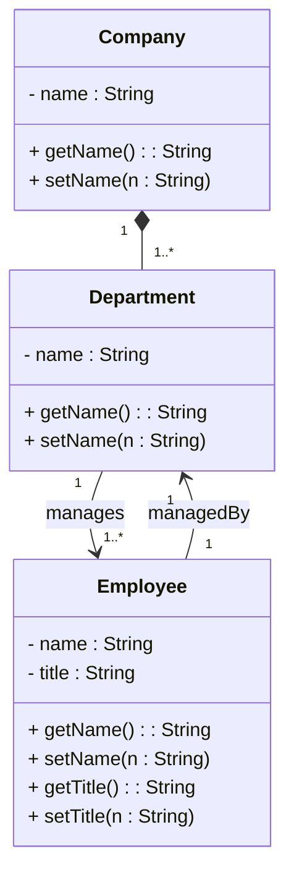
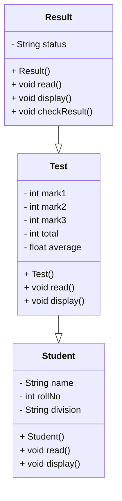

# OOP RE Exam TEE Paper

# Question 1
## Question 1 a


### Solution 1 
 
> [!Info]
> This solution is one to many based approach and uses an arraylist to link the classes instead. We have interpreted the uml diagram to have literal relations so i have created lists to do that.
> I Have queried Dr. Ashwini Ma'am for the same status.

**Question 1.jav**a
```java
/*
 * Click nbfs://nbhost/SystemFileSystem/Templates/Licenses/license-default.txt to change this license
 * Click nbfs://nbhost/SystemFileSystem/Templates/Classes/Class.java to edit this template
 */
package com.mycompany.retee;
import java .util.ArrayList;
/**
 *
 * @author TJ
 */
public class Question1 {
    public class Company{
        String name;
        ArrayList<Department> departmentList = new ArrayList<>();
        public String getName()
        {
            return this.name;
        }
        public void setName(String name)
        {
            this.name = name;
        }
        public void pushDepartment(Department dept){
            this.departmentList.add(dept);
        }
        @Override
        public String toString(){
            StringBuilder sb = new StringBuilder();
            sb.append("Company: ").append(name).append("\n").append("Departments: \n");
            
            for (Department d:departmentList){
                sb.append(d.toString());
            }
            
            
            return sb.toString();
        }
    }
    public class Department{
        String name;
        ArrayList<Employee> employeeList= new ArrayList<>();

        public String getName()
        {
            return this.name;
        }
        public void setName(String name)
        {
            this.name = name;
        }
        public void pushEmployee(Employee employee){
            this.employeeList.add(employee);
        }
        @Override
        public String toString(){
            StringBuilder sb = new StringBuilder();
            sb.append("\n \n \nDepartment Name: ").append(this.name).append("\n").append("Employees: \n \n ");
            
            for (Employee e:employeeList){
                sb.append(e.toString()).append("\n");
            }
            
            return sb.toString();
        }
    }
    public class Employee{
        String name;
        String title;
        public String getName()
        {
            return this.name;
        }
        public void setName(String name)
        {
            this.name = name;
        }
        public String getTitle()
        {
            return this.title;
        }
        public void setTitle(String title)
        {
            this.title = title;
        }
        @Override
        public String toString(){
            StringBuilder sb = new StringBuilder();
            sb.append("Employee: ").append(this.name).append("\n").append("Title:").append(this.title);
            
            return sb.toString();
        }
    }
}
```

```java
/*
 * Click nbfs://nbhost/SystemFileSystem/Templates/Licenses/license-default.txt to change this license
 */

package com.mycompany.retee;

/**
 *
 * @author TJ
 */
public class RETEE {

    public static void main(String[] args) {
        Question1 q1 = new Question1();
        Question1.Company google = q1.new Company();
        google.setName("Google");
        System.out.println(google.getName());
        
        Question1.Department cybersec = q1.new Department();
        cybersec.setName("cyberSec");
        google.pushDepartment(cybersec);
        
        Question1.Employee tj = q1.new Employee();
        tj.setName("tj");        
        tj.setTitle("Security Engineer");
        cybersec.pushEmployee(tj);
        
        System.out.println(google.toString());
        
          
    }
}
```

```bash
Google
Company: Google
Departments: 

 
 
Department Name: cyberSec
Employees: 
 
 Employee: tj
Title:Security Engineer

------------------------------------------------------------------------
BUILD SUCCESS
------------------------------------------------------------------------
Total time:  2.518 s
Finished at: 2025-04-29T10:59:26+05:
```

## Question 1 b
Implement a function that finds the number of occurrences of a specified character in the string. Write a test program that prompts the user to enter a string follöwed number of occurrences of the character in the string.
### Solution
**Question2.java**
```java
/*
 * Click nbfs://nbhost/SystemFileSystem/Templates/Licenses/license-default.txt to change this license
 * Click nbfs://nbhost/SystemFileSystem/Templates/Classes/Class.java to edit this template
 */
package com.mycompany.retee;
import java .util.ArrayList;
/**
 *
 * @author TJ
 */
public class Question1 {
    public class Company{
        String name;
        ArrayList<Department> departmentList = new ArrayList<>();
        public String getName()
        {
            return this.name;
        }
        public void setName(String name)
        {
            this.name = name;
        }
        public void pushDepartment(Department dept){
            this.departmentList.add(dept);
        }
        @Override
        public String toString(){
            StringBuilder sb = new StringBuilder();
            sb.append("Company: ").append(name).append("\n").append("Departments: \n");
            
            for (Department d:departmentList){
                sb.append(d.toString());
            }
            
            
            return sb.toString();
        }
    }
    public class Department{
        String name;
        ArrayList<Employee> employeeList= new ArrayList<>();

        public String getName()
        {
            return this.name;
        }
        public void setName(String name)
        {
            this.name = name;
        }
        public void pushEmployee(Employee employee){
            this.employeeList.add(employee);
        }
        @Override
        public String toString(){
            StringBuilder sb = new StringBuilder();
            sb.append("\n \n \nDepartment Name: ").append(this.name).append("\n").append("Employees: \n \n ");
            
            for (Employee e:employeeList){
                sb.append(e.toString()).append("\n");
            }
            
            return sb.toString();
        }
    }
    public class Employee{
        String name;
        String title;
        public String getName()
        {
            return this.name;
        }
        public void setName(String name)
        {
            this.name = name;
        }
        public String getTitle()
        {
            return this.title;
        }
        public void setTitle(String title)
        {
            this.title = title;
        }
        @Override
        public String toString(){
            StringBuilder sb = new StringBuilder();
            sb.append("Employee: ").append(this.name).append("\n").append("Title:").append(this.title);
            
            return sb.toString();
        }
    }
}

```

```bash

Calculating the occurence of letter 'u' in don uday: 
1
------------------------------------------------------------------------
BUILD SUCCESS
------------------------------------------------------------------------
Total time:  1.908 s
Finished at: 2025-04-29T11:19:23+05:30
```

# Question 2
Create a class 'student' having data members: name of the student, roll no of the student and division. Derive a class test from student having data members: marks of 3 subjects, total marks, average marks. Create a class result and check whether the student is passed or failed. Provide constructors, read ( ) and display( ) methods in all classes. Create object of class result author and display all the details with status pass or fail.
### Solution


**Result:**

```java

```

# References


###### Information
- date: 2025.04.29
- time: 10:18