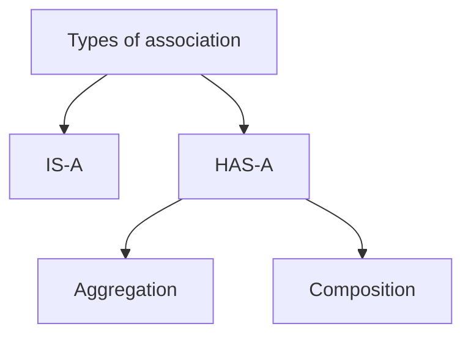
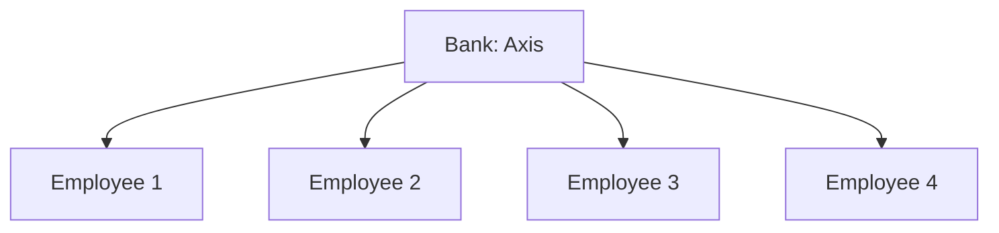
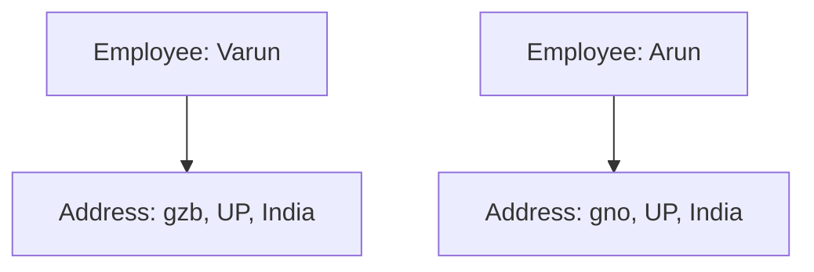
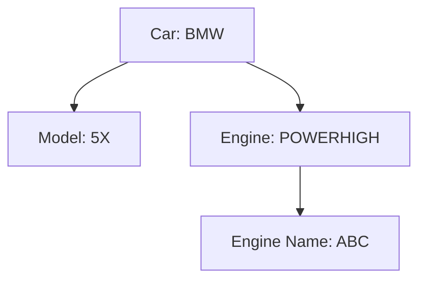

# Unified Modelling Language
We have already seen UML in [[Data Base Management System]]'s Course. In a real life project we get a problem statement from the customers. This statement is given to a separate team where they gather the **requirements**. The analysts then look at it and define the **feasibility** of it. Considering the time duration taken to complete the tasks and the features itself. There will be functionalities that can't be made into real life solutions. After this process this will be presented to the customers again. It is then that the **Deliverables** are fixed.

After the process of doing all rnd we just talked about the team talks to developers. Rather than writing down in the form of pages we give the list of **functionalities** to the development team. There will be a visual diagram given to them that shows them the flow of the functionalities. The diagram can be created with such detail that the developers don't have to mind about getting any other documentation regarding the problem statement.

Students will be given the diagrams in lab and then they are going to be asked to develop a program for the diagram
### Summary
- Requirement Gathering
- Feasibility Analysis
- Customer Approval
- Development Handoff

Example ecommerce: register, add to cart, payment gateway can be represented in a diagram.
### Rational Rose
The **Rational Rose** is an application developed by **IBM**. This application takes a diagram as an input that is to be visualised by the developer that the application converts into code. Earlier it used to give C++ code but now it can give any programming language ( Quoting ma'am ) that is suitable for the project. It is not a replacement to the entire project being programmed but it gives the user a structured pre processed code.
##### Why even bring this up?
The customers earlier used to pay for atleast 600 lines for the task that Rational Rose does. But now that this app can generate that code they save money with this application.

![[IMG-20250730000528984.png|center]]


## Examples

| Circle                                                                                         | Description                                                                                                                                                                                                     |
| ---------------------------------------------------------------------------------------------- | --------------------------------------------------------------------------------------------------------------------------------------------------------------------------------------------------------------- |
| - Radius: Double<br>- Number of objects                                                        | - Represents the radius of the circle.<br>- Keeps track of the number of circle objects created.                                                                                                                |
| + Circle()<br>+ Circle(radius: double)<br>+ getRadius(): double<br>+ getNumberOfObjects(): int | - Constructs a default circle object with a radius of 1.0.<br>- Constructs a circle object with the specified radius.<br>- Returns the radius of the circle.<br>- Returns the number of circle objects created. |
The description diagram is there for explaining the left components. The actual diagram doesn't include that. The actual diagram actually looks like this 

| Circle                                                                                         |
| ---------------------------------------------------------------------------------------------- |
| - Radius: Double<br>- Number of objects                                                        |
| + Circle()<br>+ Circle(radius: double)<br>+ getRadius(): double<br>+ getNumberOfObjects(): int |

---


# Types of Associations in UML

## Association Types
In Unified Modeling Language (UML), associations represent relationships between classes. These associations can be categorized into different types based on the nature of the relationship. Here are the main types of associations:



The diagram shows the association types in a venn diagram
![[IMG-20250730000550734.png|center|200]]

### One-to-One (1:1) Association
- **Description**: Each instance of one class is associated with exactly one instance of another class.
- **Example**: A `Person` has one `Passport`, and a `Passport` belongs to one `Person`.

### One-to-Many (1:N) Association
- **Description**: An instance of one class is associated with multiple instances of another class.
- **Example**: A `Teacher` teaches many `Students`, but each `Student` is taught by one `Teacher`.

### Many-to-One (N:1) Association
- **Description**: Multiple instances of one class are associated with one instance of another class.
- **Example**: Many `Students` can belong to one `Classroom`.

### Many-to-Many (M:N) Association
- **Description**: Instances of each class can be associated with multiple instances of the other class.
- **Example**: `Students` can enroll in multiple `Courses`, and each `Course` can have multiple `Students`.

## Java Code for Association

Below is a Java code example that demonstrates a **One-to-Many** relationship between a `Bank` and its `Employees`.

```java
import java.io.*;
import java.util.Scanner;

class Bank {
    private String name;

    Bank(String name) {
        this.name = name;
    }

    public String getBankName() {
        return this.name;
    }
}

class Employee {
    private String name;

    Employee() { }

    Employee(String name) {
        this.name = name;
    }

    public String getEmployeeName() {
        return this.name;
    }
}

class Association {
    public static void main(String[] args) {
        String name;
        Scanner inp = new Scanner(System.in);
        Bank bank = new Bank("Axis");
        Employee[] emp = new Employee[4];

        for (int i = 0; i < 4; i++) {
            name = inp.next();
            emp[i] = new Employee(name);
        }

        for (int i = 0; i < 4; i++) {
            System.out.println(emp[i].getEmployeeName() +
                " is employee of " + bank.getBankName());
        }
    }
}
```
## Diagram Representation


### Expected Output:
```bash
aaa is employee of Axis
ccc is employee of Axis
mmm is employee of Axis
ttt is employee of Axis
```

### Explanation:
- The array `Employee[] emp = new Employee[4];` implies a one-to-many relationship, where one `Bank` has multiple `Employees`.
- The loop iterates over the `Employee` array, associating each `Employee` with the `Bank`.
---
## Advanced Association Types

### Aggregation
- **Description**: A special type of association representing a "whole-part" relationship where the part can exist independently of the whole.
- **Example**: A `University` has multiple `Departments`, but a `Department` can exist without the `University`.
#### Example
Below is a Java code example that demonstrates aggregation between an `Employee` and their `Address`. In this scenario, an `Address` can exist independently of an `Employee`.
```java

public class Address {
    String city, state, country;
    
    public Address(String city, String state, String country) {
        this.city = city;
        this.state = state;
        this.country = country;
    }
}

public class Emp {
    int id;
    String name;
    Address address;
    
    public Emp(int id, String name, Address address) {
        this.id = id;
        this.name = name;
        this.address = address;
    }
    
    void display() {
        System.out.println(id + " " + name);
        System.out.println(address.city + " " + address.state + " " + address.country);
    }

    public static void main(String[] args) {
        Address address1 = new Address("gzb", "UP", "India");
        Address address2 = new Address("gno", "UP", "India");

        Emp e1 = new Emp(111, "Varun", address1);
        Emp e2 = new Emp(112, "Arun", address2);

        e1.display();
        e2.display();
    }
}

```


#### Output
```bash
graph TD;
    A[Employee: Varun] --> B[Address: gzb, UP, India];
    C[Employee: Arun] --> D[Address: gno, UP, India];

```

### Composition
- **Description**: A stronger form of aggregation where the part cannot exist independently of the whole.
- **Example**: A `Book` contains `Pages`, and `Pages` cannot exist without the `Book`.
#### Example


````java
class Car {
    // Final ensures that engine is initialized once and cannot be changed
    private final Engine engine;
    String nameOfCar;
    String model;

    public Car(String nameOfCar, String model) {
        engine = new Engine("POWERHIGH", "ABC");
        this.nameOfCar = nameOfCar;
        this.model = model;
    }

    public void showAllDetails() {
        System.out.println("Name of Car = " + nameOfCar);
        System.out.println("Name of Model = " + model);
        System.out.println("Engine used in Car = " + engine.typeOfEngine);
        System.out.println("Engine name of Car = " + engine.nameOfEngine);
    }
}

class Engine {
    String typeOfEngine;
    String nameOfEngine;

    Engine(String typeOfEngine, String nameOfEngine) {
        this.typeOfEngine = typeOfEngine;
        this.nameOfEngine = nameOfEngine;
    }
}

class ShowRoom {
    public static void main(String arg[]) {
        Car car = new Car("BMW", "5X");
        car.showAllDetails();
    }
}
````

## Key Concept:

- The `Engine` object inside `Car` is declared **`final`**, meaning **once initialized, it cannot be reassigned to another `Engine` object**.
- However, its attributes (`typeOfEngine`, `nameOfEngine`) can still be modified unless explicitly made immutable.

## Diagram Representation



## Expected Output:

```
Name of Car = BMW
Name of Model = 5X
Engine used in Car = POWERHIGH
Engine name of Car = ABC
```

---

### Reflexive Association
- **Description**: An association where a class is related to itself.
- **Example**: An `Employee` can have a relationship with another `Employee` (e.g., manager-subordinate relationship).
---

### Visual Representation

- **Aggregation**: Represented by a hollow diamond shape on the "whole" end of the association line.
- **Composition**: Represented by a filled diamond shape on the "whole" end of the association line.
- **Reflexive Association**: Represented by a line looping back to the same class.

Understanding these association types is crucial for accurately modeling relationships between classes in UML, which helps in designing robust and maintainable software architectures.
###### Information
- date: 2025.02.20
- time: 10:09