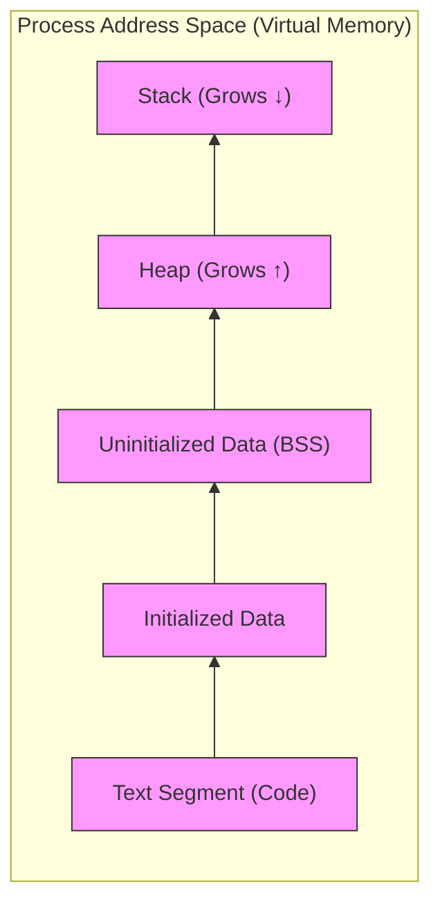

# Introduction to Processes and Scheduling
**Process** – a program in execution; process execution must progress in sequential fashion. No parallel execution of instructions of a single process​


Multiple parts​   
- The program code, also called text section​
- Current activity including program counter, processor registers​
- Stack containing temporary data​
- Function parameters, return addresses, local variables​
- Data section containing global variables​
- Heap containing memory dynamically allocated during run time​
- In a stack, the allocation and de-allocation are automatically done by the compiler whereas in heap, it needs to be done by the programmer manually.​


​Here's a concise note with a Mermaid diagram showing the memory layout of a process:

---

# Memory Layout of a Process

## Key Sections

1. **Text Segment (Code)**  
   - Contains compiled machine instructions  
   - Read-only to prevent accidental modification  
   - Shared between process instances  

2. **Data Sections**  
   - **Initialized Data**: Explicitly initialized global/static variables  
   - **BSS**: Zero-initialized or uninitialized global/static variables  

3. **Heap**  
   - Dynamically allocated memory at runtime  
   - Manually managed (`malloc()`/`free()` in C)  
   - Grows **upward** toward higher addresses  

4. **Stack**  
   - Automatic storage for function calls  
   - Contains:  
     - Local variables  
     - Function parameters  
     - Return addresses  
   - Grows **downward** toward lower addresses  

---

## Critical Considerations  
- **Collision Risk**: Uncontrolled heap/stack growth can lead to memory corruption  
- **Virtual Memory**: Modern OSes use page tables to map this layout to physical memory  
- **Process Isolation**: Each process has its own virtual address space  


| Section | Direction  | Management | Contents            |
| ------- | ---------- | ---------- | ------------------- |
| Text    | Static     | OS         | Executable code     |
| Data    | Static     | Compiler   | Global variables    |
| Heap    | ↑ Upward   | Programmer | Dynamic allocations |
| Stack   | ↓ Downward | Compiler   | Function frames     |
```

High Addresses
+------------------+
|       Stack      | ← Grows downward
+------------------+
|       ...        |
+------------------+
|       Heap       | ← Grows upward
+------------------+
| Uninitialized    |
| Data (BSS)       |
+------------------+
| Initialized Data |
+------------------+
| Text (Code)      | ← Read-only
+------------------+
Low Addresses

```
# References


###### Information
- date: 2025.05.11
- time: 19:59