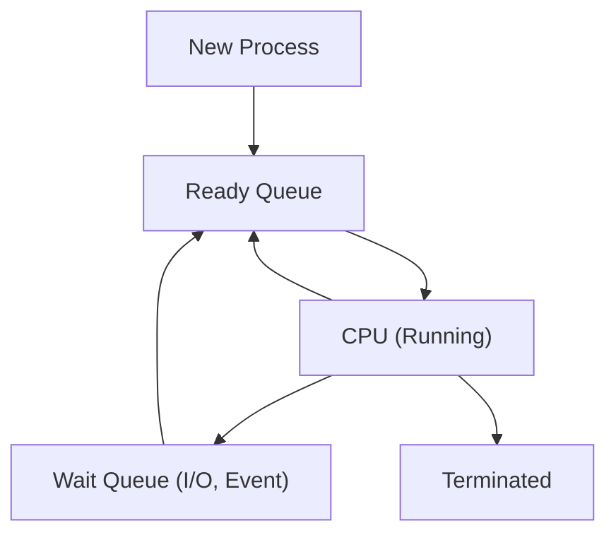

# Process Scheduling

# Process Scheduling and Queues in Operating Systems

## Overview

The **process scheduler** is a core component of the operating system responsible for selecting which process should execute next on a CPU core. Its primary goals are to maximize CPU utilization and ensure efficient, fair allocation of CPU time among all processes     .

---

## Scheduling Queues

- **Ready Queue**:  
  Contains all processes in main memory that are ready and waiting to execute. The scheduler selects processes from this queue for CPU allocation   .
- **Wait (Device) Queues**:  
  Hold processes waiting for specific events, such as I/O completion or resource availability. Each I/O device typically has its own device queue   .

Processes migrate among these queues throughout their lifecycle:
- **New processes** enter the ready queue.
- **Running processes** may move to a wait queue if they request I/O or need to wait for an event.
- **Completed I/O** or events move processes back to the ready queue.
- **Processes** may also be preempted (interrupted) and returned to the ready queue if their time slice expires or a higher-priority process arrives\ .

---

## Process Scheduling Flow

- **A process starts in the ready queue.**
- **On CPU allocation, it executes.**
- **If it needs I/O, it moves to the wait queue.**
- **Upon I/O completion, it returns to the ready queue.**
- **If preempted or its time slice ends, it returns to the ready queue.**
- **On completion, it terminates and is removed from the system.**

![[IMG-20250730000528923.png]]
---

## Context Switching

- **Context switch** occurs when the CPU switches from one process to another.
- The OS saves the state (context) of the outgoing process and loads the state of the incoming process.
- The process context is stored in the **Process Control Block (PCB)**.
- **Context-switch time** is pure overhead: no useful work is done during the switch. More complex PCBs and OSes increase this overhead.
- Some hardware supports multiple register sets to speed up context switching

![[IMG-20250730000547997.png]]

---

## Scheduling Algorithms

Common algorithms include:
- **First-Come, First-Served (FCFS)**
- **Shortest Job First (SJF)**
- **Priority Scheduling**
- **Round Robin (RR)**
- **Multilevel Queues**  
Each algorithm balances efficiency, fairness, and responsiveness differently .

---

## Summary

Process scheduling coordinates multitasking by managing ready and wait queues, migrating processes as events occur, and performing context switches as needed. This ensures high CPU utilization, fairness, and system responsiveness in a multiprogramming environment.

# References

###### Information
- date: 2025.05.11
- time: 20:49