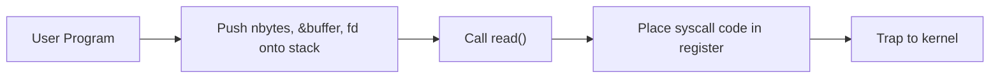
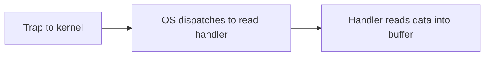
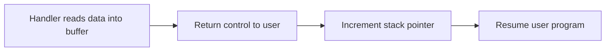
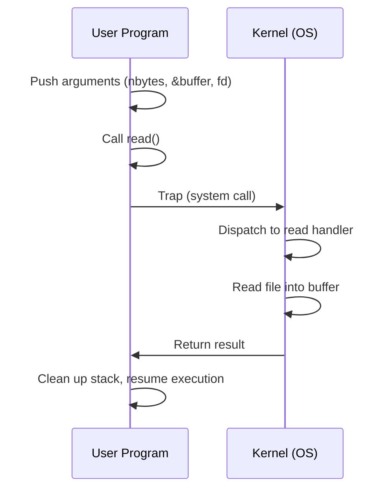
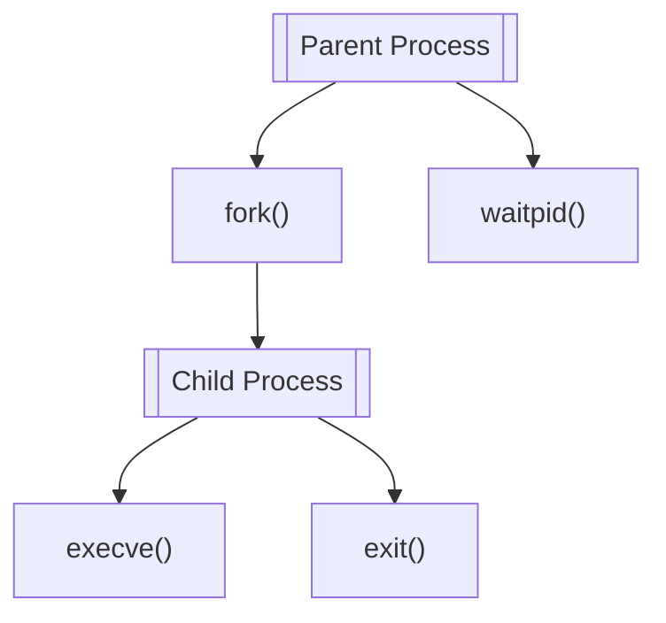
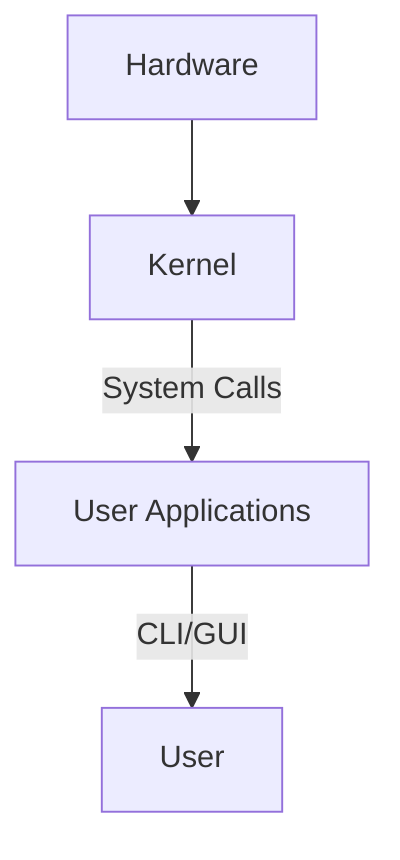
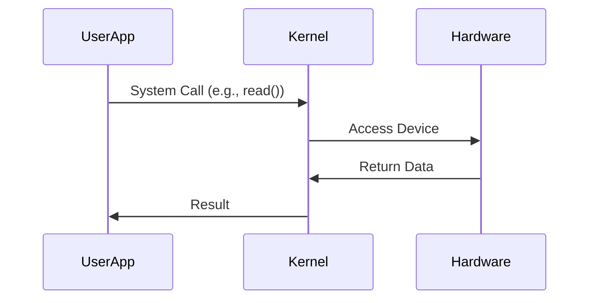
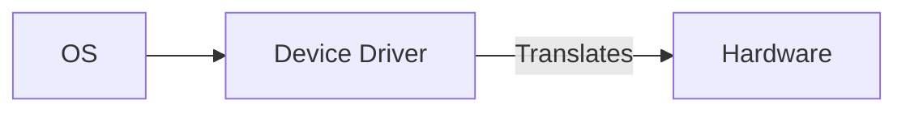

# System Calls
The operating system manages the hardware resources in form of the **services**. The mechanism used by an application program to request service from the operating system is called a **system call**.

A System call basically triggers a special machine code which causes the processor to change modes. ( Real Mode / Protected Mode / Supervisor Mode ).
## Kernel Space, Trap, and System Call
- **Kernel Space:**  
  The protected memory region where the operating system kernel, its extensions, and most device drivers run. Only privileged code can execute here, ensuring system stability and security by preventing user applications from directly accessing critical resources.
- **Trap:**  
  A mechanism (such as a software interrupt or exception) that switches the CPU from user mode to kernel mode. This transition allows the operating system to safely perform privileged operations on behalf of user programs, such as handling system calls or exceptions.
- **System Call:**  
  A controlled request from a user program to the operating system for a low-level service (e.g., file access, process management, device I/O). System calls use traps to enter kernel mode, where the OS executes the requested operation before returning control to the user program.
Absolutely! Here’s the same explanation with helpful Mermaid diagrams to make each stage visually clear:

---

## System Call Execution Flow: `read()` Example

### 1. **User Space Steps**

**Text Steps:**
- Push `nbytes`, `&buffer`, and `fd` onto the stack.
- Call the `read()` function.
- Place the system call code in a CPU register.
- Execute a trap instruction to enter kernel mode.

**Mermaid Diagram:**



---

### 2. **Kernel Space Steps**

**Text Steps:**
- OS dispatches the request to the correct system call handler.
- System call handler reads data from the file into the buffer.

**Mermaid Diagram:**



---

### 3. **Return to User Space**

**Text Steps:**
- Control returns to the user program.
- Stack pointer is incremented to clean up arguments.
- User program resumes execution.

**Mermaid Diagram:**



---

### **Overall Sequence Diagram**



---

**Summary:**  
These diagrams illustrate how a system call like `read()` safely transitions from user space to kernel space and back, with the OS handling the privileged operation in between.

Here's a concise breakdown of key process management system calls:

---

## **1. `fork()`**
- **Purpose**: Creates a child process (exact copy of parent).  
- **Behavior**:  
  - Returns **child's PID** in parent, **0** in child[1][5][7].  
  - Copies memory, file descriptors, and execution context[1][6][7].  
- **Example**:  
  ```c
  pid_t pid = fork();
  if (pid == 0) { /* Child executes here */ }
  ```

---

## **2. `execve()`**
- **Purpose**: Replaces current process with a new program.  
- **Usage**:  
  ```c
  execve("program", argv, environp);
  ```
  - `argv`: Array of command-line arguments.  
  - `environp`: Environment variables[6][7].  
- **Key**: Never returns on success; existing code is replaced[1][5][7].

---

## **3. `waitpid()`**
- **Purpose**: Parent waits for specific child to terminate.  
- **Parameters**:  
  - `pid`: Target child process ID.  
  - `statloc`: Stores exit status (use `WIFEXITED`, `WEXITSTATUS`)[1][5][7].  
  - `options`: Control behavior (e.g., `WNOHANG` for non-blocking)[5][7].  
- **Flow**:  
  ```mermaid
  sequenceDiagram
      Parent->>Parent: waitpid(pid)
      Parent->>Child: Suspended until child exits
      Child->>Parent: Sends exit status
      Parent->>Parent: Resumes execution
  ```

---

## **4. `exit()`**
- **Purpose**: Terminates process and returns status.  
- **Status Codes**:  
  - `0`: Success.  
  - Non-zero: Error (conventionally)[1][5][7].  
- **Effect**:  
  - OS notifies parent via `waitpid()`.  
  - Resources (memory, files) are released[1][6].

---

### **Typical Workflow**


**Key Interactions**:  
- Parent uses `fork()` + `waitpid()` to manage child execution.  
- Child uses `execve()` to run new programs and `exit()` to terminate[1][5][7].  
- **PID Handling**:  
  ```c
  if (pid == 0) { 
      execl("/bin/ls", "ls", NULL);  // Child becomes 'ls'
      exit(1);  // Only reached if exec fails
  } else {
      waitpid(pid, &status, 0);  // Parent waits
  }
```


## File Management System Calls

|Unix Call|Description|Win32 Call|Description|
|---|---|---|---|
|`open()`|Open file for reading/writing|`CreateFile()`|Open or create a file|
|`close()`|Close an open file|`CloseHandle()`|Close a file handle|
|`read()`|Read data from file into buffer|`ReadFile()`|Read data from a file|
|`write()`|Write data from buffer to file|`WriteFile()`|Write data to a file|
|`lseek()`|Move the file pointer|`SetFilePointer()`|Move the file pointer|
|`stat()`|Get file status information|`GetFileAttributesEx()`|Get file attributes|

## Directory Management System Calls

|Unix Call|Description|Win32 Call|Description|
|---|---|---|---|
|`mkdir()`|Create a new directory|`CreateDirectory()`|Create a new directory|
|`rmdir()`|Remove an empty directory|`RemoveDirectory()`|Remove a directory|
|`link()`|Create a new entry (hard link)|-|Not supported|
|`unlink()`|Remove a directory entry (file)|`DeleteFile()`|Delete a file|
|`mount()`|Mount a filesystem|-|Not supported|
|`umount()`|Unmount a filesystem|-|Not supported|
|`chdir()`|Change current working directory|`SetCurrentDirectory()`|Change current directory|

## Miscellaneous System Calls

|Unix Call|Description|Win32 Call|Description|
|---|---|---|---|
|`chmod()`|Change file protection bits|-|Not directly supported|
|`kill()`|Send a signal to a process|-|Not directly supported|
|`time()`|Get current time|`GetLocalTime()`|Get current time|

**Legend:**

- = Not supported or no direct equivalent in Win32
    

This compact format lets you quickly compare and reference system calls across Unix and Windows.
![[Pasted image 20250511195217.png|600]]
![[Pasted image 20250511195352.png|600]]

Here's a structured, concise summary of operating system components using Obsidian-friendly formatting with embedded diagrams and callouts:

---

# Operating System Core Components



## 1. **Kernel**  
> [!kernel]- Core Responsibilities  
> Manages hardware resources through:  
> - **Process Scheduling**  
> - **Memory Allocation**  
> - **Device Control**  
> Operates in privileged **kernel mode**.

---

## 2. **System Calls**  

- **Examples**:  
  - File I/O: `open()`, `read()`  
  - Process: `fork()`, `execve()`  
  - Network: `socket()`, `send()`

---

## 3. **User Interface**  
| **Type** | **Description** |  
|----------|------------------|  
| CLI | Command execution via text (e.g., `bash`) |  
| GUI | Visual interaction (e.g., Windows Explorer) |  

---

## 4. **Device Drivers**  

- Standardizes access to printers, disks, etc.

---

## 5. **File System**  
**Functions**:  
- Hierarchical storage (e.g., `/home/docs`)  
- Permissions: `chmod`, `chown`  
- Metadata: `stat()`

---

## 6. **Process Management**  
- **States**:  
  ```mermaid
  flowchart LR
      New --> Ready --> Running --> Wait --> Terminated
  ```
- **Schedulers**: Round Robin, Priority-based

---

## 7. **Memory Management**  
- **Virtual Memory**:  
  $$ \text{Virtual Address} = \text{Page Table}[\text{VPN}] + \text{Offset} $$  
- Techniques: Paging, Segmentation

---

## 8. **Network Stack**  
**TCP/IP Layers**:  
1. Application (HTTP)  
2. Transport (TCP)  
3. Network (IP)  
4. Link (Ethernet)

---

## 9. **Security**  
**CIA Triad**:  
- **Confidentiality**: Encryption  
- **Integrity**: Checksums  
- **Availability**: Redundancy

---

## 10. **Utilities**  
- **System**: `ls`, `grep`  
- **User**: Browsers, Text Editors

---

# Summary  
Modern OS architectures (client-server, distributed) rely on **system calls** to bridge user applications and kernel-resident services, ensuring secure and efficient resource management.

---
Answer from Perplexity: pplx.ai/share


###### Information
- date: 2025.05.11
- time: 17:40